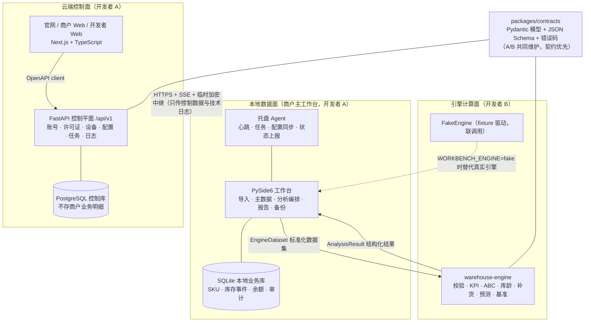
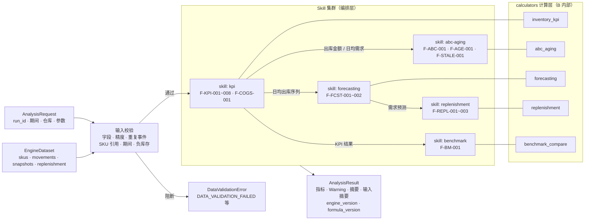
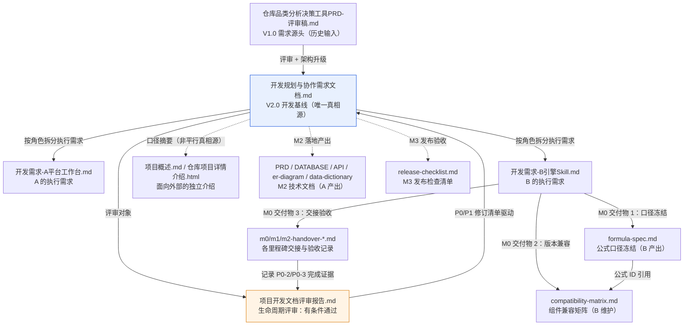

# 仓库品类分析决策工具（warehouseAnalysis）

一套帮助中小仓库管理者、商家和采购负责人的**本地优先**库存品类分析决策工具：把 Excel/CSV 流水导入本地工作台，统一清洗校验后输出动销、周转、库龄、ABC、呆滞、补货与预测等结构化指标，辅助采购决策。

- **产品形态**：Windows 本地工作台（PySide6）+ 商户 Web 管理端 + 开发者管理模式 + 微信小程序预留接口
- **当前状态**：M3 已交付（PR #21）—— 托盘 Agent、小程序事件同步链路、控制平面配置/任务/心跳/同步端点、升级安全与打包发布脚本全部落地；引擎 engine 0.3.0 五类公式 18 个指标，工作台默认接真实引擎
- **核心原则**：云端统一管理产品能力和运行状态，本地保存并处理商户业务数据；先确保数据正确、可追溯、可恢复，再逐步增加 AI 和移动端能力

---

## 一、项目摘要

中小仓库普遍存在三类痛点：**数据有但不会用**（流水散落在 Excel 中，缺少可对比的指标口径）、**采购靠经验**（缺少周转率、库龄结构等量化依据）、**结果无法持续触达**（分析停留在报表里）。

本工具采用"本地优先"设计应对：商户的货品、库存流水、成本、采购和分析明细全部保存在商户自己的电脑上（SQLite）；开发者平台（FastAPI + PostgreSQL）只负责账号、许可证、配置、版本、设备状态和脱敏技术日志，不默认保存完整库存业务数据。断网时本地核心工作不中断，恢复网络后再同步状态。

两名开发者按"平台集成"（A：官网/Web/API/工作台/交付）与"核心引擎"（B：标准化/计算引擎/Skill/评测）分工，通过版本化 contracts、FakeEngine 和自动化契约测试并行开发，互不阻塞。

## 二、架构说明

### 1. 软件总架构

三层运行面：**云端控制面**（账号/授权/配置/状态）、**本地数据面**（商户业务数据 + 桌面工作台）、**引擎计算面**（纯 Python 分析引擎，无 UI/HTTP/ORM 依赖，可独立发布为 wheel）。



关键边界：

- **数据边界**：`inventory_event` 是库存事实来源，余额是可重建投影；错误不直接覆盖库存，用冲销或调整事件。云端不建商户 `sku`/`movement`/`unit_cost` 表。
- **契约边界**：跨模块数据必须经过 contracts 模型和版本检查；引擎不连接数据库、不读用户文件、不访问网络。
- **替换机制**：工作台通过 `WarehouseEngine` Protocol 调用引擎，环境变量 `WORKBENCH_ENGINE=fake|local` 只在组合根读取；**默认走真实引擎**（engine 0.3.0，PR #14 交付），仍需冻结结果联调时显式设 `WORKBENCH_ENGINE=fake`。

### 2. Skill 集群架构及工作流、逻辑链

五个 Skill 运行在 warehouse-engine 内，每个 Skill 只做**参数校验 → 计算顺序编排 → 结果组合**，不执行 Shell、不访问用户文件、不下载代码。公式实现在 calculators 层，口径由 `docs/formula-spec.md` 冻结（F-* 公式编号），公式与代码解耦保证版本可追溯。



**逻辑链说明**（自底向上依赖）：

1. **kpi 是根节点**：产出出库量、动销率、周转率/天数、库存价值、COGS（移动加权平均）、覆盖天数等基础指标，是其余 Skill 的输入源。
2. **abc-aging 消费 KPI 的出库金额**：按期间出库金额降序做 ABC 分层（A≤80%、B≤95%），并基于事件/快照口径计算库龄分桶与呆滞判定（观察窗口默认 90 天）。
3. **forecasting 消费日均出库序列**：M0 冻结 4 周移动平均基线模型，输出预测与 MAPE/MAE/RMSE 误差评估；样本不足（<12 期）自动降级并告警。
4. **replenishment 消费需求侧数据**：安全库存 SS=z·σ_d·√LT、补货点 ROP、建议量（下限 0）；参数缺失返回 `PARAM_MISSING` 非阻断状态，不输出建议。
5. **benchmark 消费 KPI 结果**：与行业基准库对比（基准必须含来源/行业/版本等元数据），无匹配返回 `BENCHMARK_UNAVAILABLE`。

所有结果携带 `run_id`、数据期间、`formula_version` 和输入摘要（sha256 digest），保证可追溯与历史重开；异常数据产生结构化 Warning（code/severity/message/fields/blocking 五要素），不静默丢弃。

## 三、项目结构说明

```text
warehouseAnalysis/
├── apps/
│   ├── workbench-desktop/          # 开发者 A：PySide6 工作台（presentation/application/domain/infrastructure/workers）
│   └── web/                        # 开发者 A：Next.js 官网、商户模式、开发者模式
├── services/
│   └── control-plane/              # 开发者 A：FastAPI /api/v1、认证、设备、配置、状态、同步、日志
├── local-data/                     # 开发者 A：本地 SQLite ORM、Alembic 迁移、Repository
├── packages/
│   ├── contracts-python/           # 共同维护：Pydantic 模型、枚举、错误码（A/B 契约唯一来源）
│   ├── contracts-schema/           # 共同维护：JSON Schema / OpenAPI 快照（CI 防漂移门禁）
│   └── warehouse-engine/           # 开发者 B：纯 Python 分析引擎
│       └── src/warehouse_engine/
│           ├── engine.py           #   WarehouseEngine：validate_dataset / analyze / list_capabilities
│           ├── fake.py             #   FakeEngine：fixture 驱动，供 A 的工作台联调
│           ├── validation/         #   输入校验：字段、精度、重复事件、期间、负库存
│           ├── calculators/        #   五个计算器（KPI/ABC库龄/预测/补货/基准，公式口径见 docs/formula-spec.md）
│           ├── errors.py           #   错误码 → 异常映射
│           └── result.py           #   结构化结果与输入摘要（dataset digest）
├── skills/                         # 开发者 B：五个 SKILL.md + manifest.json（版本/兼容矩阵/降级策略）
├── tests/
│   ├── contract/                   # 契约正反例、Schema 一致性、fixture 过 Schema 校验
│   ├── engine/                     # 引擎接口、黄金数据、边界数据、Hypothesis 库存守恒
│   └── fixtures/                   # golden v0.1.0~v0.4.0 黄金数据 + edge/ 八类边界样例 + benchmarks/ 行业基准
├── docs/                           # 项目文档（见下节）
├── scripts/                        # export_schemas.py、perf_bench.py、verify_schema.py、
│                                   #   verify_backup_restore.py、export_openapi.py、
│                                   #   build_release.py（M3 打包发布）、e2e_m3_flow.py（M3 端到端演练）
│                                   #   installer/warehouse-workbench.iss（Inno Setup 安装包脚本）
├── .github/workflows/              # engine-ci.yml（B 侧）、platform-ci.yml（A 侧）
├── pyproject.toml / uv.lock        # uv workspace 根配置与锁文件（CPython 3.11）
├── package.json / pnpm-lock.yaml   # pnpm workspace 根配置（Node.js 22 LTS）
├── docker-compose.dev.yml          # 本地 PostgreSQL 容器
└── CHANGELOG.md                    # 变更记录
```

## 四、docs 文件夹文档说明

| 文档 | 性质 | 说明 |
|---|---|---|
| [项目概述.md](docs/项目概述.md) | 面向外部 | 面向客户、销售、支持和新成员的独立说明：产品是什么、解决什么问题、组成、数据边界与当前限制 |
| [仓库品类分析决策工具PRD-评审稿.md](docs/仓库品类分析决策工具PRD-评审稿.md) | 历史输入 | V1.0 产品需求文档评审稿（早期 CLI 形态），是后续开发基线的需求源头 |
| [开发规划与协作需求文档.md](docs/开发规划与协作需求文档.md) | **唯一真相源** | V2.0 最终开发基线：架构、数据库、技术选型冻结表、M0-M8 排期、契约优先机制、协作规则 |
| [开发需求-A平台工作台.md](docs/开发需求-A平台工作台.md) | 角色执行文档 | 开发者 A 的执行需求与验收清单：官网/Web/API/工作台/数据库/同步/发布 |
| [开发需求-B引擎Skill.md](docs/开发需求-B引擎Skill.md) | 角色执行文档 | 开发者 B 的执行需求与验收清单：标准化、引擎、Skill、黄金数据、性能评测与发布门槛 |
| [项目开发文档评审报告.md](docs/项目开发文档评审报告.md) | 质量门禁 | 依据生命周期规范对开发文档的评审：有条件通过进入 M0，P0/P1 修订清单与 G0-G7 Gate 判断 |
| [formula-spec.md](docs/formula-spec.md) | B 侧交付 | 公式口径冻结文档：KPI/COGS/ABC/库龄/呆滞/补货/预测七类口径、F-* 公式编号、容差总表（M0 双签冻结） |
| [compatibility-matrix.md](docs/compatibility-matrix.md) | B 侧交付 | 组件兼容矩阵初版：Desktop/API/Engine/Skill/contracts/DB 版本规则与当前状态 |
| [m0-handover-b.md](docs/m0-handover-b.md) | B 侧交付 | M0 交接说明：安装命令、公开入口、依赖版本、合并门槛验证记录、P0 自查与 M1 缺口清单 |
| [m1-handover-a.md](docs/m1-handover-a.md) | A 侧交付 | M1 交接说明：本地业务闭环（导入/分析/报告/备份）、数据库迁移与联调证据 |
| [m1-handover-b.md](docs/m1-handover-b.md) | B 侧交付 | M1 交接说明：KPI 引擎 0.2.0、黄金数值层扩展、首个 wheel 交付与性能基线 |
| [m2-handover-b.md](docs/m2-handover-b.md) | B 侧交付 | M2 交接说明：engine 0.3.0 五类公式 18 指标、Skill 全实装、实验模型隔离与 M3 建议 |
| [PRD.md](docs/PRD.md) / [DATABASE.md](docs/DATABASE.md) / [API.md](docs/API.md) | A 侧交付 | M2 技术文档：产品需求 / 数据库设计（ER 图与数据字典）/ 控制平面 API 参考 |
| [er-diagram.md](docs/er-diagram.md) / [data-dictionary.md](docs/data-dictionary.md) | A 侧交付 | 数据库配套：实体关系图与字段级数据字典 |
| [release-checklist.md](docs/release-checklist.md) | M3 交付 | 发布前检查清单：打包、安装、升级、回滚、断网恢复等验收项 |
| [仓库项目详情介绍.html](docs/仓库项目详情介绍.html) | 面向外部 | HTML 版项目介绍页 |

**文档关系**：



阅读顺序建议：新成员从 [项目概述.md](docs/项目概述.md) 入手 → [开发规划与协作需求文档.md](docs/开发规划与协作需求文档.md) 建立全貌 → 按角色读 A/B 执行文档 → [项目开发文档评审报告.md](docs/项目开发文档评审报告.md) 了解当前质量门禁状态。

---

**快速开始**（Python 3.11 + uv；Web 另需 Node.js 22 LTS + pnpm）：

```powershell
# 首次安装
uv sync --all-packages --group dev
pnpm install
docker compose -f docker-compose.dev.yml up -d postgres   # 本地 PostgreSQL

# 启动云端 API / Web / 工作台
cd services/control-plane; uv run uvicorn app.main:app --reload --port 8000   # 完成后 cd 回仓库根
pnpm --filter web dev
cd apps/workbench-desktop; uv run python -m app.main   # 默认真实引擎；WORKBENCH_ENGINE=fake 切换联调；完成后 cd 回仓库根

# 全量检查
uv run pytest
uv run ruff check packages scripts tests services local-data apps
pnpm lint
pnpm typecheck
uv run python scripts/export_schemas.py                    # 重新导出 JSON Schema
```

详细交接信息见 [docs/m0-handover-b.md](docs/m0-handover-b.md)（B 侧 M0）及 m1/m2-handover-\* 系列（按里程碑），M3 发布验收见 [docs/release-checklist.md](docs/release-checklist.md)。
