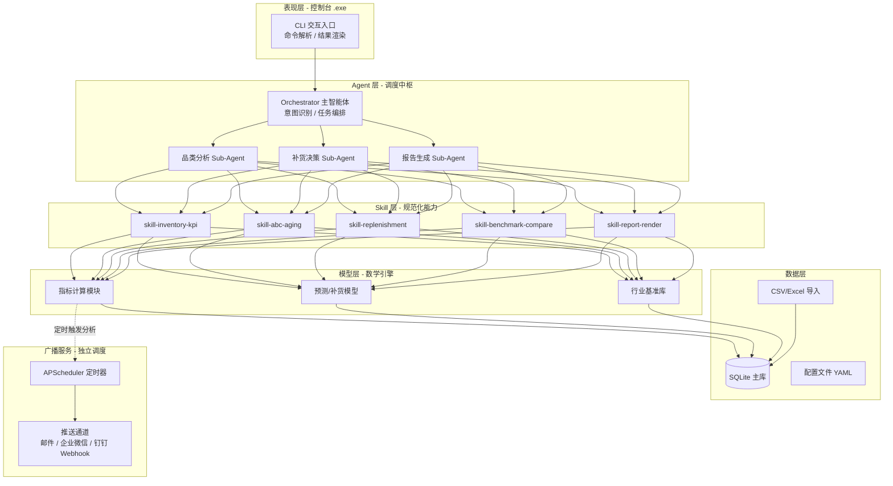
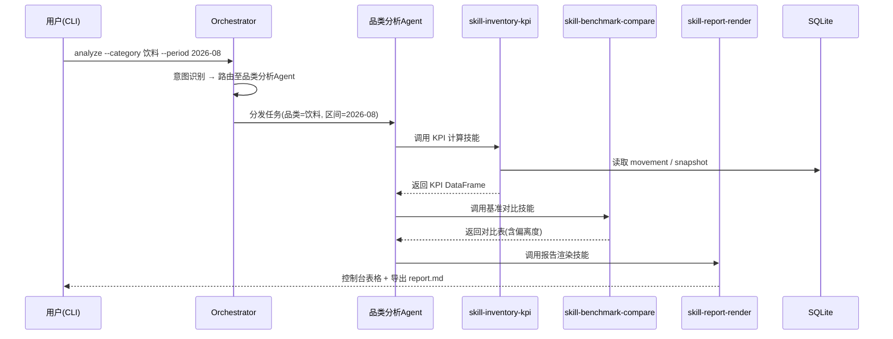

# 仓库品类分析决策工具 PRD（产品需求文档）
**版本**：V1.0 | **日期**：2026-08-28 | **状态**：评审稿
---
## 1. 产品概述
### 1.1 产品定位
本产品是一款面向中小仓库管理者和商家的**本地化桌面分析决策工具（.exe）**，基于 Python 构建。产品通过为仓库各品类建立数学模型（出入库、留存时长、出货率、出货速度等），输出结构化的分析结论与采购决策建议，并通过 AI Agent + Skill 机制实现规范化分析流程，最终通过定时广播将关键洞察推送至管理者。产品一期交付控制台 .exe 与 Agent/Skill 架构设计，二期完成可运行 Demo。
### 1.2 要解决的核心问题
仓库管理中普遍存在三类痛点，本产品逐一应对：
- **数据有但不看**：出入库记录散落在 Excel/WMS 导出表中，缺少周期性、可对比的指标口径，管理者对"哪些品类动销快、哪些积压"缺乏量化认知。
- **决策靠经验**：采购方向依赖个人判断，缺少基于周转率、出货率、库龄结构等行业基准的对比依据，导致热销品缺货、滞销品积压并存。
- **洞察不触达**：即使产出分析结论，也停留在报表里，没有固定机制在关键时段（如每日晨会前、每周补货前）主动推送给决策人。
### 1.3 目标用户与核心场景
| 用户角色 | 核心诉求 | 典型场景 |
|---------|---------|---------|
| 仓库管理者 | 掌握品类动销与积压情况，优化库位与盘点重点 | 每日开仓前查看昨日各品类出货率与呆滞预警 |
| 商家/采购负责人 | 确定采购方向与补货量，避免资金积压 | 每周补货前查看 ABC 分类、周转对比、补货点建议 |
| 运营/数据分析岗 | 快速产出可对比的品类分析报告 | 月度复盘时导出品类对比与库龄结构报告 |
### 1.4 产品目标与衡量指标
| 目标 | 衡量指标（上线后 3 个月） |
|------|------------------------|
| 缩短品类分析产出时间 | 单次全量分析耗时 ≤ 5 分钟（1 万 SKU 规模） |
| 提升采购决策数据化率 | 采购建议采纳率 ≥ 60%（以广播推送后的操作回流统计） |
| 降低呆滞库存占比 | 客户仓库呆滞库存金额占比环比下降 ≥ 15% |
---
## 2. 总体架构设计
### 2.1 分层架构
系统采用五层架构，控制台入口 → Agent 调度 → Skill 执行 → 数学模型引擎 → 数据层，广播模块作为独立调度服务旁路运行。

### 2.2 技术栈选型
| 层级 | 技术选型 | 说明 |
|------|---------|------|
| 打包分发 | **PyInstaller（--onefile）** | 将 Python 解释器与依赖打包为单文件 .exe，用户无需安装 Python 环境 |
| 控制台交互 | rich + prompt_toolkit | 支持表格渲染、进度条、语法高亮的现代 CLI |
| 数据处理 | pandas + numpy | 出入库流水清洗、聚合、透视 |
| 本地存储 | SQLite（SQLAlchemy ORM） | 单文件数据库，随 .exe 分发零配置 |
| 数学建模 | scipy + statsmodels | 安全库存（正态分布 Z 值）、移动平均预测、MAPE 评估 |
| AI 能力 | LLM API（OpenAI 兼容接口）+ 自建 Agent 框架 | Agent 编排与 Skill 加载参照分层加载机制 |
| 定时广播 | APScheduler | 进程内定时任务，支持 cron 表达式 |
| 消息推送 | SMTP（邮件）+ 企业微信/钉钉 Webhook | 三通道可配置，失败自动降级 |
### 2.3 目录结构建议
```
warehouse-analyzer/
├── main.py                  # CLI 入口
├── agents/
│   ├── orchestrator.py      # 主调度 Agent
│   └── subagents/           # 品类/补货/报告子 Agent
├── skills/
│   ├── skill-inventory-kpi/
│   │   ├── SKILL.md         # 元数据 + 指令
│   │   ├── scripts/         # 可执行计算脚本
│   │   └── references/      # 公式与基准参考
│   ├── skill-abc-aging/
│   ├── skill-replenishment/
│   ├── skill-benchmark-compare/
│   └── skill-report-render/
├── models/
│   ├── kpi_engine.py        # 指标计算引擎
│   ├── forecasting.py       # 预测模型
│   └── benchmarks.yaml      # 行业基准库
├── data/
│   ├── importers/           # CSV/Excel 导入器
│   └── db.py                # SQLite ORM
├── broadcast/
│   ├── scheduler.py         # APScheduler 封装
│   └── channels/            # 邮件/企微/钉钉推送通道
├── config.yaml              # 用户配置
└── build.spec               # PyInstaller 打包配置
```
---
## 3. 功能需求：一期 vs 二期
一期聚焦**架构设计与骨架搭建**，交付可运行的控制台 .exe 骨架、Agent/Skill 框架代码与行业基准库；二期聚焦**功能完整落地**，交付可用的分析 Demo 与完整 Agent/Skill 实现。
### 3.1 一期功能范围（架构 + 骨架）
| 模块 | 功能点 | 优先级 | 验收标准 |
|------|--------|--------|---------|
| 控制台骨架 | CLI 命令注册、参数解析、帮助系统 | P0 | `warehouse.exe --help` 列出全部命令 |
| 数据导入 | CSV/Excel 出入库流水导入（含字段映射） | P0 | 样例数据（1000 条）导入成功率 100% |
| 数据模型 | SQLite 表结构建表与 ORM 映射 | P0 | SKU/出入库/库存三表可增删改查 |
| Agent 框架 | Orchestrator + Sub-Agent 调度骨架（意图路由可用） | P0 | 输入"分析品类出货率"能正确路由至品类分析 Sub-Agent |
| Skill 框架 | SKILL.md 解析、分层加载（元数据→指令→资源）机制 | P0 | Skill 元数据注入系统提示词，调用时加载完整指令 |
| 基准库 | 行业周转率/出货率基准数据落库（YAML） | P0 | 覆盖 ≥ 8 个行业分类的基准值 |
| 打包 | PyInstaller 单文件打包脚本 | P0 | 双击 .exe 可在无 Python 环境的 Windows 机器运行 |
| 广播骨架 | 定时任务注册 + 推送通道接口定义 | P1 | 可配置 cron 并触发空推送 |
### 3.2 二期功能范围（完整功能）
| 模块 | 功能点 | 优先级 | 验收标准 |
|------|--------|--------|---------|
| 指标计算 | 出货率、出货速度、周转率/周转天数、库龄、ABC 分类全量计算 | P0 | 与手工 Excel 计算结果误差为 0 |
| 对比分析 | 品类间横向对比、环比/同比、行业基准偏离度 | P0 | 输出对比表格与偏离度标记 |
| 补货模型 | 安全库存、补货点（ROP）、EOQ 计算 | P1 | 基于 Z 值服务水平参数可配 |
| 预测 | 移动平均/加权移动平均需求预测，MAPE 误差评估 | P1 | 预测 MAPE ≤ 25%（快消品类样例） |
| AI 分析 | Agent 调用 Skill 完成端到端分析并生成自然语言结论 | P0 | 输入分析指令，输出含数字与建议的结构化报告 |
| 报告渲染 | 控制台表格 + Markdown 报告导出 | P1 | 支持导出 .md 报告文件 |
| 广播落地 | 每日/每周定时分析并推送至邮件/企微/钉钉 | P0 | 定时触发后 5 分钟内送达，含核心指标摘要 |
| 呆滞预警 | 库龄超阈值 SKU 自动识别与预警推送 | P1 | 90 天未动销 SKU 全量捕获并推送 |
---
## 4. 核心功能模块详细设计
### 4.1 数据导入与数据结构
支持两种输入方式：CSV/Excel 批量导入（一期）与模板填写（二期）。核心表结构如下：
**SKU 主表（sku）**
| 字段 | 类型 | 说明 |
|------|------|------|
| sku_id | TEXT PK | 商品唯一编码 |
| name | TEXT | 品名 |
| category | TEXT | 品类（一级） |
| sub_category | TEXT | 子品类 |
| unit | TEXT | 单位 |
| unit_cost | REAL | 单位成本 |
| industry | TEXT | 所属行业（用于基准匹配） |
**出入库流水表（movement）**
| 字段 | 类型 | 说明 |
|------|------|------|
| move_id | INTEGER PK | 流水号 |
| sku_id | TEXT FK | 商品编码 |
| move_type | TEXT | 入库 / 出库 / 退货入库 / 报废出库 |
| quantity | REAL | 数量 |
| unit_price | REAL | 单价 |
| move_date | DATE | 日期 |
| warehouse_id | TEXT | 仓库编码 |
| order_no | TEXT | 关联单号（可选） |
**库存快照表（stock_snapshot）**：按日/周存储期末结存，用于周转率计算的分母。
字段映射规则：导入时提供模板（`sku_id, move_type, quantity, unit_price, move_date`），异常数据（负库存、缺失主键、日期格式错误）进入隔离区，控制台展示错误明细供人工修复。
### 4.2 数学模型与指标计算引擎（模型层核心）
以下为 Skill 调用的底层计算公式，全部收敛在 `models/kpi_engine.py` 中实现。
#### 4.2.1 基础指标
| 指标 | 计算公式 | 业务含义 |
|------|---------|---------|
| 平均库存 | (期初库存 + 期末库存) / 2 | 周转率分母 |
| 库存周转率 | 销售成本（COGS）/ 平均库存 | 年周转次数，反映变现速度 |
| 库存周转天数（DIO） | 365 / 周转率 | 平均库龄天数 |
| 出货率（Sell-Through Rate） | 期间出库量 / 期初库存量 × 100% | 期内售罄比例，行业健康值 70–80% |
| 出货速度 | 期间出库量 / 期间天数 | 日均出货量，判断动销快慢 |
| 库龄 | 当前日期 − 最近一次入库日期 | 单批次滞留时长 |
#### 4.2.2 结构分析指标
| 指标 | 计算公式 | 用途 |
|------|---------|------|
| ABC 分类 | 按年销售额 × 毛利贡献降序累计：A 类前 70% 金额（约 15% SKU）、B 类 70–90%（约 25% SKU）、C 类后 10%（约 60% SKU） | 差异化补货策略 |
| 呆滞库存率 | 呆滞库存金额（如 90 天未动销）/ 总库存金额 × 100% | 积压预警，阈值 ≤ 6% |
| 库存早期预警 | 呆滞天数 ≥ 阈值 → 触发预警 | 主动预警机制 |
#### 4.2.3 补货与预测指标
| 指标 | 计算公式 | 参数说明 |
|------|---------|---------|
| 安全库存（SS） | SS = Z × σ_d × √L | Z：服务水平系数（95% → 1.65）；σ_d：日需求标准差；L：补货提前期（天） |
| 补货点（ROP） | ROP = 平均日需求 × L + SS | 库存降至该点触发采购建议 |
| 经济订购量（EOQ） | Q* = √(2DS / H) | D：年需求量；S：单次订购成本；H：单位持有成本 |
| 移动平均预测 | 未来需求 = 最近 n 期出库均值 | n 可配，默认 4 期 |
| 预测误差（MAPE） | Σ(\|预测−实际\| / 实际) / n × 100% | 模型精度评估 |
#### 4.2.4 行业基准库（用于对比分析）
行业基准数据基于公开供应链研究与行业统计，落库为 `benchmarks.yaml`，作为对比偏离度计算的分母。核心基准值如下：
| 行业分类 | 典型年周转率（次/年） | 健康出货率参考 | 库存周转天数（DIO） | 数据来源 |
|---------|-------------------|--------------|-------------------|---------|
| 快消品（FMCG）/ 生鲜日化 | 15–20（食品饮料日化）， Grocery 15–30 | ≥ 80% | 12–24 天 |  |
| 服饰零售 | 4–8（快时尚可 > 15） | 70–80%（季末需清仓） | 45–90 天 |  |
| 综合零售 / 电商 | 8–12 | 70–80% | 30–60 天 |  |
| 消费电子 | 4.5–10 | 60–70% | 40–70 天 |  |
| 制造业 | 4–8 | — | 45–90 天 |  |
| 汽配 | 3–6 | — | 60–120 天 |  |
| 医药 | 3–6 | — | 60–120 天 |  |
| 高端奢侈品 | 0.5–2 | — | 180–365 天 |  |
| 五金建材 | 4–8 | — | 45–90 天 |  |
| 批发分销 | 5–12 | — | 40–70 天 |  |
> 基准使用规则：同一绝对数值在不同行业含义完全不同（例如周转率 4 次在五金行业属优秀，在生鲜行业则属异常偏低），因此对比分析必须先匹配 SKU 的行业标签，再计算偏离度 = (客户实际值 − 行业基准中位值) / 行业基准中位值。
### 4.3 Agent / Skill 架构设计
#### 4.3.1 设计原则
参照当前 Agent Skill 的主流分层加载（progressive disclosure）机制：Agent 启动时仅注入各 Skill 的元数据（name + description）；当任务触发某 Skill 时才加载完整指令；执行过程中按需读取脚本与参考资料，避免一次性占满上下文窗口。
#### 4.3.2 Agent 分层
采用"Orchestrator + Sub-Agent"两层结构，主智能体负责意图识别与任务编排，子智能体各自绑定专属 Skill 集与提示词，通过共享 SQLite 上下文传递中间结果。
| Agent | 职责 | 绑定 Skill |
|-------|------|-----------|
| Orchestrator（主调度） | 解析用户指令、路由至子 Agent、汇总最终输出 | — |
| 品类分析 Sub-Agent | 执行出货率/周转/库龄/ABC 分析 | skill-inventory-kpi, skill-abc-aging |
| 补货决策 Sub-Agent | 计算安全库存/ROP/EOQ，给出采购方向建议 | skill-replenishment, skill-benchmark-compare |
| 报告生成 Sub-Agent | 将结构化结果转为自然语言结论与 Markdown 报告 | skill-report-render |
#### 4.3.3 Skill 清单与职责边界
| Skill 名称 | 功能 | 输入 | 输出 |
|-----------|------|------|------|
| skill-inventory-kpi | 计算出货率、出货速度、周转率/天数等核心 KPI | 时间区间、品类过滤条件 | DataFrame（指标表） |
| skill-abc-aging | ABC 分类与库龄/呆滞识别 | 库存快照 + 出库流水 | ABC 标签表、呆滞 SKU 列表 |
| skill-replenishment | 安全库存、ROP、EOQ 计算与补货量建议 | SKU 需求历史、服务水平参数 | 补货建议表 |
| skill-benchmark-compare | 与行业基准对比，计算偏离度并标记 | 指标表 + 行业标签 | 对比表（含偏离度列） |
| skill-report-render | 生成控制台表格与 Markdown 报告 | 各 Skill 输出汇总 | 控制台表格 + .md 文件 |
#### 4.3.4 Skill 规范（SKILL.md 模板）
每个 Skill 目录包含 `SKILL.md`（YAML frontmatter + Markdown 指令）、`scripts/`（自包含可执行脚本，明确声明依赖）、`references/`（公式与行业基准说明）。
```yaml
# skills/skill-inventory-kpi/SKILL.md
---
name: skill-inventory-kpi
description: 计算指定时间区间内各品类的出货率、出货速度、库存周转率与周转天数
version: 1.0.0
categories: [inventory, kpi]
---
# 库存核心 KPI 计算技能
## 使用场景
当用户要求分析品类出货情况、周转效率时调用本技能。
## 基础指令
1. 调用 scripts/calc_kpi.py，传入时间区间与品类过滤参数
2. 脚本从 SQLite 读取 movement 与 stock_snapshot 表
3. 按以下公式计算并返回 DataFrame：
   - 出货率 = 期间出库量 / 期初库存量 × 100%
   - 出货速度 = 期间出库量 / 期间天数
   - 周转率 = COGS / 平均库存
   - 周转天数 = 365 / 周转率
4. 结果写入共享上下文表 kpi_result，供下游 Skill 使用
## 输入参数
- start_date / end_date: 统计区间
- category: 品类过滤（可选，缺省为全部）
## 输出
- DataFrame: [sku_id, category, sell_through_rate, ship_speed, turnover_ratio, dio]
```
#### 4.3.5 调用流程示例

### 4.4 广播功能设计
#### 4.4.1 触发机制
采用 APScheduler 进程内调度，用户在 `config.yaml` 中配置定时规则；到点后自动触发完整分析流水线（KPI → 基准对比 → 异常检测），并将结果摘要推送至指定通道。
```yaml
# config.yaml 广播配置示例
broadcast:
  jobs:
    - name: daily_morning_brief
      cron: "0 8 * * *"          # 每日 08:00
      scope: { period: "yesterday", category: "all" }
      channels: [email, wecom]
    - name: weekly_replenish_report
      cron: "0 9 * * 1"          # 每周一 09:00
      scope: { period: "last_7d", category: "all", include_replenishment: true }
      channels: [dingtalk, email]
  channels:
    email: { smtp_host: "…", to: ["manager@corp.com"] }
    wecom: { webhook_url: "https://…" }
    dingtalk: { webhook_url: "https://…", secret: "…" }
```
#### 4.4.2 推送通道
| 通道 | 实现 | 降级策略 |
|------|------|---------|
| 邮件（SMTP） | smtplib + MIMEText，附 Markdown 报告 | 失败重试 3 次后记录本地日志 |
| 企业微信群机器人 | Webhook POST JSON（markdown 消息类型） | 失败降级为邮件通道 |
| 钉钉群机器人 | Webhook POST（含加签 secret） | 失败降级为邮件通道 |
#### 4.4.3 推送内容模板
每日晨报包含四部分：① 全仓核心指标汇总（出货率、周转天数、呆滞占比）；② Top 5 动销最快品类；③ 呆滞预警清单（库龄 ≥ 90 天 SKU）；④ 补货触发清单（库存 ≤ ROP 的 SKU 及建议采购量）。
---
## 5. 非功能需求
| 维度 | 要求 |
|------|------|
| 性能 | 1 万 SKU、10 万条流水的全量分析 ≤ 5 分钟；单品类查询 ≤ 3 秒 |
| 打包体积 | .exe ≤ 150 MB（含 Python 运行时与依赖） |
| 兼容性 | Windows 10/11 x64 免安装运行；不依赖用户侧 Python 环境 |
| 数据安全 | 全部数据本地存储（SQLite），不上传云端；LLM 调用仅传输脱敏后的指标汇总，不传原始流水 |
| 可配置性 | 服务水平 Z 值、呆滞阈值、广播 cron、推送通道均可通过 config.yaml 配置 |
| 可扩展性 | 新增行业基准仅需修改 benchmarks.yaml；新增 Skill 遵循目录规范即可被 Orchestrator 自动发现 |
---
## 6. 里程碑与排期
| 阶段 | 交付物 | 建议周期 |
|------|--------|---------|
| 一期 M1 | 需求冻结、数据结构定稿、行业基准库数据搜集与落库 | 第 1–2 周 |
| 一期 M2 | CLI 骨架 + 数据导入 + SQLite ORM + PyInstaller 打包链路打通 | 第 3–4 周 |
| 一期 M3 | Agent 框架（Orchestrator/Sub-Agent 路由）+ Skill 分层加载机制 + SKILL.md 规范定稿 | 第 5–6 周 |
| 一期 M4 | 广播调度骨架（APScheduler + 通道接口），一期验收 | 第 7 周 |
| 二期 M5 | KPI 引擎全量计算 + ABC/库龄 + 基准对比（skill 脚本实现） | 第 8–9 周 |
| 二期 M6 | 补货模型（SS/ROP/EOQ）+ 移动平均预测 | 第 10 周 |
| 二期 M7 | Agent 端到端分析链路（指令 → 分析 → 自然语言报告） | 第 11 周 |
| 二期 M8 | 广播落地（三通道推送 + 内容模板）+ Demo 验收 | 第 12 周 |
---
## 7. 风险与开放问题
| 风险/问题 | 影响 | 应对 |
|----------|------|------|
| 客户原始数据字段不统一 | 导入失败率高 | 提供标准导入模板 + 字段映射配置 + 异常数据隔离区人工修复 |
| PyInstaller 打包 LLM 依赖包体积过大、启动慢 | 用户体验下降 | 采用 --onedir 备选方案权衡启动速度；依赖裁剪（--exclude-module） |
| LLM API 网络不可用（内网部署场景） | AI 分析功能不可用 | Skill 的计算层完全本地化（纯 Python 脚本），LLM 仅用于结论生成，断网时降级输出纯结构化报告 |
| 行业基准数据时效性 | 对比结论失真 | 基准库版本化管理，每季度人工复核更新一次 |
| 单文件 .exe 杀毒软件误报 | 分发受阻 | 构建时申请代码签名证书，或提供 --onedir 版本作为备选 |
**待确认的开放问题**：① 目标客户主力行业是哪一类（决定基准库优先级与 Demo 样例数据）？② 是否需要多仓库支持（影响数据模型中 warehouse_id 维度的聚合逻辑）？③ 广播是否需要支持自定义内容的自由编排（影响报告模板的抽象层级）？
---
## 附录 A：术语表
| 术语 | 定义 |
|------|------|
| SKU | Stock Keeping Unit，最小库存单位 |
| COGS | Cost of Goods Sold，销售成本 |
| DIO | Days Inventory Outstanding，库存周转天数 |
| ROP | Reorder Point，再订货点/补货点 |
| EOQ | Economic Order Quantity，经济订购量 |
| MAPE | Mean Absolute Percentage Error，平均绝对百分比误差 |
| Sell-Through Rate | 出货率，期内出库量占期初库存的比例 |
| Agent | 能自主感知、决策、执行的智能体，由 LLM 驱动 |
| Skill | 封装特定任务逻辑、可被 Agent 调用的模块化能力单元 |
## 附录 B：一期 Agent/Skill 设计架构交付物清单
1. `agents/orchestrator.py`：意图识别（规则 + 语义混合路由）与 Sub-Agent 调度骨架
2. `agents/subagents/*.py`：三个子 Agent 的提示词模板与工具绑定
3. `skills/*/SKILL.md`：五个 Skill 的规范文件（frontmatter + 指令 + 脚本占位）
4. `skills/*/scripts/`：Skill 执行脚本（一期为接口占位 + 输入输出 schema 定义）
5. `models/benchmarks.yaml`：行业基准库（覆盖附录 A 所列 ≥ 8 个行业）
6. `build.spec`：PyInstaller 打包配置，一键产出 `warehouse-analyzer.exe`
---
以上即为本产品完整 PRD。行业基准数据部分已基于公开供应链研究整理落库（详见 4.2.4 节），计算公式部分（详见 4.2.1–4.2.3 节）可直接作为 Skill 脚本的实现规格。后续推进时建议先冻结第 7 节的三个开放问题，再进入一期 M1 的数据结构定稿。
