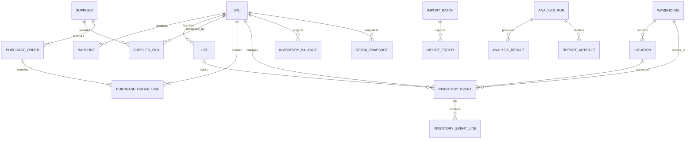
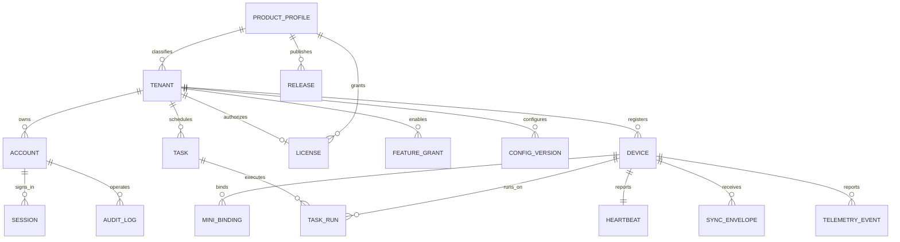

# 仓库品类分析决策工具：开发规划与协作需求文档

**文档版本**：V2.0（最终开发基线）  
**编写日期**：2026-08-28  
**依据文档**：[仓库品类分析决策工具 PRD（评审稿）](E:/TSUKI/Documents/xwechat_files/wxid_r86kffpl7bd422_5341/msg/file/2026-08/仓库品类分析决策工具PRD-评审稿.md)  
**参考规范**：[软件开发全生命周期指南](E:/TSUKI/Documents/xwechat_files/wxid_r86kffpl7bd422_5341/msg/file/2026-08/软件开发全生命周期指南.md)  
**文档状态**：前后端分离、模块化、数据库与双人协作最终基线（正式开发前仍需完成 M0 签字）  
**开发模式**：两人并行开发，公共接口先行，分支独立、持续集成、阶段联调

> **唯一真相源**：本文件已经合并原《数据库架构与建库设计》中的数据库数量、ER 关系、表分组、迁移、备份恢复和测试要求。正式开发时以本文件、`contracts`、`OpenAPI` 和已合并的 ADR 为准，不再维护另一份平行数据库设计稿。

### 文档使用方式

| 文档 | 使用者 | 用途 | 是否作为开发依据 |
|---|---|---|---|
| 本文件 | A、B、评审人 | 总体架构、数据库、模块边界、流程、质量门禁 | 是，唯一开发基线 |
| `仓库品类分析决策工具-开发需求-A平台工作台.md` | A | A 的任务拆解、交接物和验收 | 是，受本文件约束 |
| `仓库品类分析决策工具-开发需求-B引擎Skill.md` | B | B 的任务拆解、公式、引擎和评测 | 是，受本文件约束 |
| `仓库品类分析决策工具-项目概述.md` | 客户、销售、支持、新成员 | 产品用途、边界和价值说明 | 否，不替代开发基线 |

---

## 1. 文档目的

本文件将原 PRD 进一步转换为可执行的开发计划，解决以下问题：

- 明确产品最终形态和本地优先的数据边界。
- 明确商户、工作台、小程序、商户 Web 端和开发者管理平台之间的职责。
- 明确两位开发者的代码所有权、交付物和完成标准。
- 规定核心引擎与工作台之间的输入输出契约，避免互相依赖内部实现。
- 规定每个模块的单元测试、集成测试、验收测试和性能测试。
- 为暂不开发的微信小程序保留接口、数据模型和模拟测试入口。
- 形成客户可以理解、可以安装、可以恢复、可以验证的交付标准。

---

## 2. 已确认的产品决策

### 2.1 产品定位

产品定位为：

> **本地优先的仓库品类分析与调度工作台，配套商户 Web 管理端、微信小程序采集端和开发者运营管理平台。**

它不是把商户库存全部上传到云端的 SaaS 库存系统，也不是只提供命令行计算脚本的工具。

### 2.2 数据原则

- 商户货品、库存流水、成本、采购价格、供应商和分析明细优先保存在商户电脑本地。
- 云端保存账号、许可证、设备、配置、任务状态、运行状态和技术日志。
- 小程序业务事件需要经过云端同步中继才能到达商户电脑；事件应采用加密、短期保留和确认后删除策略。
- 原始业务数据默认不持久化在开发者管理平台。
- 商户完整业务审计记录保存在本地；云端只接收必要的技术诊断和状态摘要。

### 2.3 账号和产品模式

- 第一版只支持一个商户主账号，不开发商户员工管理界面。
- 底层仍保留 `merchant_id`、`account_id` 和 `device_id`，为未来增加员工和角色做准备。
- 一个商户账号可以在工作台、Web 端和微信小程序登录。
- 工作台、小程序和 Web 都是设备或会话，不能只依靠一个共享密码识别操作来源。
- 每个新商户注册后使用同一套产品代码和服务，不为每个商户复制开发一套工作台。
- 后续按行业类型提供不同安装包或功能配置，例如零售、批发、制造、汽配；不按单个客户分叉代码。

### 2.4 开发者管理模式

- 商户模式和开发者模式可以在同一个 Web 应用中通过界面切换。
- 切换按钮只是界面入口，真正的隔离由后端角色、权限范围和 API Scope 保证。
- 开发者平台统一管理许可证、模型、API、Skill、行业基准、版本、功能开关和商户运行状态。
- 开发者默认管理配置和状态，不默认查看商户完整业务明细。

---

## 3. 总体架构

### 3.1 四个平面

```text
公共官网和下载中心
        |
        v
云端控制平面（账号、授权、配置、设备、状态、日志）
        |                         |
        | HTTPS / SSE              | 临时加密同步中继
        v                         v
本地工作台（本地数据、计算、调度、备份） <--> 微信小程序采集端
        |
        v
开发者运营管理模式（同一 Web 应用的受保护管理域）
```

### 3.2 系统职责

#### 本地工作台：业务数据平面

- 本地 SQLite 保存商户业务数据。
- 执行 CSV/Excel 导入、清洗、校验和错误隔离。
- 执行 KPI、ABC、库龄、补货和预测计算。
- 执行本地调度任务并生成报告。
- 维护本地库存事件、操作日志、分析运行记录和备份。
- 后台同步 Agent 负责心跳、配置拉取、任务接收和小程序事件同步。

#### Web 平台：云端控制平面

- 商户注册和登录。
- 许可证、产品类型、设备和小程序绑定管理。
- 商户状态、工作台状态、同步状态和任务状态展示。
- 配置发布、版本管理、功能开关和通知配置。
- 开发者模式下管理全部商户和产品能力。
- 通过 SSE 推送状态变化，30 秒轮询作为降级方案。

#### 微信小程序：采集端（本期只保留设计，不开发）

- 保留登录、绑定、扫码入库、扫码出库、盘点和采购录入的接口设计。
- 本期使用 Mock 客户端或 Postman 验证后端同步协议。
- 不在本期实现小程序页面、微信审核和发布流程。

#### 官网和下载中心：公共产品入口

- 提供产品介绍、安装包、版本说明、操作文档、绑定教程、常见问题和隐私说明。
- 安装包提供数字签名、版本号、SHA-256 校验值和更新日志。
- 官网、商户管理端和开发者管理端应有清晰的入口区分。

### 3.3 数据权威来源

| 数据类型 | 权威来源 | 说明 |
|---|---|---|
| 商户原始库存和流水 | 商户本地工作台 | 云端默认不保存完整明细 |
| 账号和许可证 | 云端控制平面 | 工作台使用缓存授权进行离线宽限 |
| 工作台在线状态 | 工作台 Agent 心跳 | 云端保存状态投影 |
| 配置和能力版本 | 开发者平台 | 工作台本地缓存最近一次有效版本 |
| 库存事件去重 | `event_id`/`idempotency_key` | 云端中继负责接收去重，本地负责业务校验 |
| 分析结果 | 工作台本地 | 报告可导出；云端只保存任务状态和摘要 |
| 技术日志 | 开发者平台 | 必须脱敏，不包含完整商品和价格信息 |

### 3.4 客户使用流程

1. 商户从官网选择行业类型并下载安装包。
2. 商户注册或登录账号，工作台注册设备并获取许可证和配置。
3. 工作台初始化本地数据库，商户导入货品和库存流水。
4. 工作台生成一次性小程序绑定二维码。
5. 小程序登录后绑定商户和指定工作台。
6. 商户在小程序中扫码录入业务事件。
7. 事件经过加密同步中继传递给工作台。
8. 工作台本地校验、写入数据库并返回处理结果。
9. Web 端实时显示工作台在线状态、同步状态和任务状态。
10. 工作台本地执行分析、调度、报告和备份任务。

---

## 4. 第一版范围和非目标

### 4.1 第一版必须完成

- 商户注册、登录、许可证校验和设备绑定。
- 本地工作台的数据库初始化、数据导入、错误隔离和本地分析。
- 核心引擎和五个 Skill 的可调用实现。
- 商户 Web 端的设备、状态、授权和任务展示。
- 开发者 Web 模式的商户、版本、配置、模型和 Skill 管理。
- 工作台后台 Agent 的心跳、配置同步、任务同步和技术日志上报。
- 本地备份、恢复和 CSV/Excel/Markdown 导出。
- 小程序同步协议、绑定接口和 Mock 测试，不开发小程序界面。
- Windows 安装包、卸载、升级和版本回滚方案。

### 4.2 第一版明确不做

- 商户员工、邀请、组织层级和复杂 RBAC 界面。
- 多台工作台同时作为主节点的多主同步。
- 云端完整库存明细和云端完整业务报表。
- 微信小程序页面开发、微信审核和正式发布。
- 复杂的远程库存修改或远程执行任意脚本。
- 在没有真实客户数据和验收基准时承诺采购建议一定被采纳。

---

## 5. 两人开发范围和交付物

以下以“开发者 A”为官网、工作台和平台负责人，以“开发者 B”为核心引擎和 Skill 负责人。两人对公共契约、集成测试和发布共同负责。

### 5.1 开发者 A：产品端、工作台和平台

#### A1. 官网与下载中心

- 产品官网和安装包下载。
- 安装流程、首次登录、绑定和常见问题文档。
- 版本发布页、更新日志、SHA-256 校验值和隐私说明。
- 下载包按行业类型或产品配置展示，不按商户定制代码。

#### A2. 商户 Web 管理端

- 商户登录、注销、会话续期和账号禁用反馈。
- 工作台设备列表、在线状态、版本和最后同步时间。
- 小程序绑定状态和解绑入口。
- 调度任务列表、执行状态、失败原因和重试状态。
- 商户级配置查看和允许商户修改的参数。

#### A3. 开发者管理模式

- 开发者登录、角色判断和开发者模式入口。
- 商户列表、许可证、产品类型和设备管理。
- 全局配置、Skill 版本、模型配置和功能开关。
- 客户端版本、安装包和升级渠道管理。
- 技术日志、心跳、同步错误和任务状态查询。
- 高风险操作二次确认、审计和临时支持授权。

#### A4. 云端控制服务

- 账号和商户服务。
- 设备、许可证和产品类型服务。
- 配置中心和版本化发布。
- SSE 实时状态服务，客户端断线自动重连。
- 同步中继、事件去重和同步状态服务。
- 任务状态、心跳、技术日志和审计接口。

#### A5. 本地工作台壳和基础能力

- PySide6 桌面界面和导航。
- 本地数据库初始化、迁移和配置缓存。
- CSV/Excel 导入界面、字段映射、错误隔离和修复导出。
- 分析任务编排、结果展示、Markdown 报告导出。
- 本地调度、备份、恢复和导出。
- 后台同步 Agent、心跳、配置拉取和任务状态上报。
- Windows 安装包、签名、自动更新和回滚。

#### A 交付完成标准

- 新商户可以从官网下载安装包并在干净 Windows 环境完成首次登录。
- 商户账号不能访问开发者接口和其他商户数据。
- 工作台关闭或断网后，Web 端能正确显示离线或待同步状态。
- 配置发布、撤销、回滚和客户端确认链路可测试。
- 本地数据库可以备份、恢复，并在恢复失败时保护现有数据。
- 工作台端到端流程可以使用 B 提供的固定测试数据完成分析。

### 5.2 开发者 B：核心引擎和 Skill

#### B1. 数据标准化和校验

- 定义标准输入数据结构。
- 处理日期、数量、金额、单位和退货等边界。
- 设计负库存、缺失 SKU、重复流水和日期异常的错误码。
- 输出可供工作台展示的结构化错误信息。

#### B2. KPI 引擎

- 出货率、出货速度、周转率、周转天数和平均库存。
- 明确期间口径、年化规则、成本口径和零值处理。
- 输出指标值、单位、公式版本、数据区间和警告。

#### B3. ABC、库龄和呆滞

- 按批次或约定的库存口径计算库龄。
- ABC 分类明确销售额、毛利或综合指标的具体规则。
- 计算呆滞金额、呆滞率和阈值预警。
- 对无入库日期、负库存和退货情况给出可解释的降级结果。

#### B4. 补货和预测

- 安全库存、ROP、EOQ 和补货量计算。
- 明确提前期、MOQ、包装倍数、在途量和订货成本缺失时的规则。
- 移动平均、加权移动平均和误差评估。
- 实际值为零时不使用未定义的 MAPE，改用 WAPE、sMAPE 或标记不可计算。

#### B5. Skill 实现和基准库

- 实现 `skill-inventory-kpi`、`skill-abc-aging`、`skill-replenishment`、`skill-benchmark-compare` 和 `skill-report-render`。
- 提供 SKILL.md、输入输出 Schema、版本和依赖说明。
- 行业基准记录来源、地区、样本范围、更新时间和版本。
- Skill 不直接修改工作台数据库，只返回结构化结果。

#### B6. 测试数据和黄金结果

- 提供最小可运行样例数据集。
- 提供人工核验的黄金结果。
- 提供大数据量性能数据集。
- 提供边界场景数据集：零库存、无销售、退货、负库存、跨月、缺成本、实际值为零。

#### B 交付完成标准

- 所有核心公式都有单元测试和黄金数据对照。
- 相同输入、相同公式版本得到确定性结果。
- 引擎不依赖 PySide6、FastAPI、SQLite Session 或 Web UI。
- 工作台可以通过公共接口调用引擎，不需要读取 B 的内部模块。
- 计算结果包含公式版本、数据区间、警告和输入摘要。
- 在约定硬件环境下满足 1 万 SKU、10 万条流水的性能目标。

### 5.3 两人共同负责

- 数据契约和错误码评审。
- 本地数据库和引擎输入之间的适配层。
- API/OpenAPI 契约和版本兼容。
- 端到端联调和发布验收。
- 安全、隐私、备份恢复和升级测试。
- 真实或脱敏客户数据的试运行反馈。

---

## 6. 对接契约和代码边界

### 6.1 建议代码仓库结构

```text
warehouse-analyzer/
├── apps/
│   ├── workbench-desktop/       # A：PySide6 工作台和托盘常驻进程
│   └── web/                     # A：官网、商户模式、开发者模式和文档
├── services/
│   └── control-plane/           # A：认证、配置、设备、状态、同步、日志 API
├── packages/
│   ├── contracts/               # 共同维护：Pydantic/JSON Schema/OpenAPI
│   └── warehouse-engine/        # B：纯 Python 计算引擎
├── skills/                      # B：五个 Skill、SKILL.md、脚本和参考资料
├── local-data/                  # A：本地数据库、迁移、备份和同步适配
├── tests/
│   ├── integration/             # 共同维护：跨模块测试
│   ├── e2e/                     # A：工作台和 Web 端到端测试
│   └── fixtures/                # B 提供黄金结果和测试数据
├── docs/                        # 共同维护：安装、操作、接口和运维文档
└── ci/                          # A：构建、测试、打包和发布脚本
```

### 6.2 引擎接口原则

- `warehouse-engine` 只接受标准化数据对象，不直接查询数据库。
- 引擎不依赖 UI、HTTP、SQLite、SQLAlchemy Session 或开发者平台。
- 工作台负责从本地数据库取数、组装输入、保存结果和展示。
- 引擎只返回结构化结果和警告，不直接输出不可追溯的自然语言结论。
- 报告渲染可以由工作台完成，LLM 只解释已验证的结构化结果。

建议的抽象对象：

```python
class AnalysisRequest(BaseModel):
    schema_version: str
    run_id: str
    start_date: date
    end_date: date
    warehouse_ids: list[str] = []
    category: str | None = None
    parameters: dict[str, Any] = {}

class AnalysisResult(BaseModel):
    schema_version: str
    run_id: str
    engine_version: str
    formula_version: str
    metrics: list[dict[str, Any]]
    warnings: list[dict[str, Any]]
    summary: dict[str, Any]
```

实际实现时应避免直接共享可变 DataFrame 作为跨模块协议，优先使用 Pydantic 模型或明确的 Arrow/JSON Schema。DataFrame 可以在引擎内部使用。

### 6.3 Skill 接口原则

- 每个 Skill 有 `name`、`version`、`input_schema`、`output_schema`、`dependencies` 和 `permissions`。
- Skill 输入输出必须可序列化，便于测试、缓存和审计。
- Skill 不直接写入公共 `kpi_result` 表，工作台统一持久化分析运行结果。
- 结果必须带 `run_id`，避免多个任务互相覆盖。
- Skill 包需要签名、版本和校验值；开发者平台只发布可信版本。
- Skill 脚本禁止任意访问用户文件和执行任意系统命令。

### 6.4 API 契约最小集合

以下接口本期由 A 预留和实现，微信小程序只使用 Mock 客户端验证：

```text
POST   /api/v1/auth/login
POST   /api/v1/auth/refresh
GET    /api/v1/account/me
GET    /api/v1/devices
POST   /api/v1/devices/register
POST   /api/v1/mini-bindings/create
POST   /api/v1/mini-bindings/confirm
DELETE /api/v1/mini-bindings/{id}
GET    /api/v1/config/current
POST   /api/v1/heartbeat
GET    /api/v1/events/stream
GET    /api/v1/tasks/pull
POST   /api/v1/tasks/{run_id}/status
POST   /api/v1/telemetry/events
POST   /api/v1/sync/events
GET    /api/v1/sync/events/pull?cursor=...
POST   /api/v1/sync/events/{event_id}/ack
```

业务事件必须包含 `event_id` 和 `idempotency_key`。重复请求必须返回同一处理结果，不能生成重复库存流水。

---

## 7. 最小数据模型

### 7.1 本地数据库

至少包含以下表或等价结构：

- `sku`：货品、分类、单位、成本和行业标签。
- `barcode`：一个 SKU 对应多个条码和包装规格。
- `warehouse`：仓库信息。
- `location`：库位信息。
- `lot`：批次、生产日期和有效期，可按行业启用。
- `inventory_event`：入库、出库、退货、报废、调拨、盘点和冲销事件。
- `stock_snapshot`：按日或按周期的库存快照。
- `analysis_run`：任务、数据区间、引擎版本、公式版本和状态。
- `analysis_result`：结构化指标和预警。
- `sync_outbox`：本地待上传的状态或技术事件。
- `sync_inbox`：云端下发、待本地处理的事件。
- `config_cache`：最近一次有效的签名配置。
- `backup_record`：备份时间、版本、路径、校验值和结果。
- `local_audit_log`：完整本地业务操作日志。

库存事件采用追加式记录，不通过直接修改余额修复错误；错误使用冲销或调整事件处理。

### 7.2 云端控制数据库

- `tenant`：商户。
- `account`：商户主账号和开发者账号，使用不同角色和权限域。
- `device`：工作台、Web 会话和小程序设备。
- `license`：套餐、到期时间、设备数和功能能力。
- `product_profile`：零售、批发、制造等行业类型。
- `config_version`：全局或商户配置版本。
- `skill_release`：Skill 版本、校验值和兼容范围。
- `model_provider`：开发者管理的模型和 API 配置引用。
- `heartbeat`：工作台最后心跳和运行状态。
- `task`、`task_run`：任务计划和执行投影。
- `sync_envelope`：同步事件的临时密文、状态和过期时间。
- `telemetry_event`：技术日志、性能和错误摘要。
- `audit_log`：开发者操作和高风险支持访问记录。

云端控制数据库不应默认建立 `sku`、`movement`、`unit_cost` 等完整业务表。

---

## 8. 技术栈建议

### 8.1 本地工作台

- Python 3.11：科学计算库、PyInstaller 和 Windows 兼容性更稳妥。
- PySide6：适合桌面窗口、表格、导入向导、进度和状态展示。
- SQLAlchemy 2 + Alembic：本地数据库 ORM 和迁移。
- SQLite：本地业务主库，放在用户数据目录。
- pandas + numpy：清洗和数据处理。
- scipy + statsmodels：预测和统计模型，按实际使用裁剪依赖。
- `warehouse-engine`：B 提供的纯 Python 引擎包。
- `httpx`：访问控制平面 API。
- Python `logging` 或结构化日志库：本地日志和技术日志分离。

### 8.2 云端控制平面

- FastAPI：认证、配置、设备、状态、同步和开发者管理 API。
- SQLAlchemy 2 + Alembic：服务端 ORM 和迁移。
- PostgreSQL：商户、账号、许可证、配置、任务和日志元数据。
- SSE：状态实时推送；浏览器断线自动重连，30 秒轮询作为降级。
- 第一版部署单个 API 实例，不引入 Redis；需要横向扩容时再加入 Redis Pub/Sub 和分布式锁。
- JWT Access Token + Refresh Token：不同终端使用不同 Scope。
- 对象存储：只存安装包、文档和经商户授权的备份，不默认存业务库。

### 8.3 Web 端和官网

- Next.js + React + TypeScript，同一应用承载官网、文档、商户模式和开发者模式。
- 管理端使用 Ant Design，优先保证表格、筛选、状态和表单效率。
- 官网和文档使用 Next.js App Router + MDX，公共页面与受保护管理路由分组隔离。
- TanStack Query：缓存 API 状态并处理重试和失效。
- OpenAPI 生成 TypeScript 客户端，避免手写接口类型。

### 8.4 打包、发布和质量工具

- PyInstaller `--onedir` 作为第一版首选，减少启动慢、杀毒误报和排查困难；`--onefile` 作为可选分发包。
- Inno Setup 或 NSIS：安装、卸载、数据目录保护和升级。
- Windows 代码签名证书：降低安装和更新拦截风险。
- pytest、pytest-qt、Hypothesis：Python 单元、桌面和属性测试。
- Playwright：Web 端端到端测试。
- Ruff、mypy、ESLint、Prettier：统一质量门禁。
- GitHub Actions 或等价 CI：每次合并自动测试和构建。

### 8.5 选型原则

- 优先选择两人都能维护的成熟组件，不为第一版引入不必要的微服务。
- 引擎和工作台同为 Python，可以直接调用，降低 IPC 和跨语言调试成本。
- Web 和云端通过 OpenAPI 对接，前端不直接访问数据库。
- 科学计算依赖必须锁版本并生成构建清单，避免不同电脑结果不一致。

---

## 9. 功能需求补充

### 9.1 本地工作台

- 首次启动显示版本、隐私提示、登录和设备注册。
- 首次登录后下载产品类型和配置，不下载商户业务数据。
- 提供导入向导、字段映射、预览、校验、错误隔离和修复导出。
- 所有分析任务显示数据区间、过滤条件、公式版本、引擎版本和警告。
- 报告显示数据来源和生成时间，不能只输出无来源的自然语言结论。
- 第一版由工作台托盘常驻进程执行后台 Agent 和调度任务；关闭窗口只隐藏到托盘，显式“退出工作台”才停止后台任务。
- 任务失败可以查看错误码、重试和导出诊断信息。
- 本地报告支持 Markdown，后续可扩展 Excel/PDF。
- 业务数据、技术日志和同步日志分开存储。

### 9.2 商户 Web 端

- 登录后只能看到自己的商户空间。
- 展示工作台在线、离线、版本、最后同步、待同步事件和备份状态。
- 展示调度任务的计划、执行、失败、重试和错过状态。
- 支持生成和撤销小程序绑定二维码。
- 支持查看授权和功能开关，但不允许商户修改开发者专属配置。
- 展示隐私、备份和导出说明。

### 9.3 开发者 Web 模式

- 商户、设备、版本、许可证和产品类型管理。
- 全局和商户级配置管理，配置必须有版本、发布人和发布时间。
- Skill 发布、停用、回滚和兼容性管理。
- 模型供应商、API 配额和调用失败状态管理。
- 工作台和小程序管理应理解为设备、授权、配置、绑定和运行状态管理。
- 不提供任意系统命令执行功能。
- 支持按商户查看技术日志和脱敏诊断包。
- 高风险操作需要二次确认并记录审计日志。

### 9.4 官网和文档

- 安装包下载和版本选择。
- 最低系统要求和依赖说明。
- 首次安装、登录、数据导入、备份、恢复、绑定和同步教程。
- 断网、工作台离线、同步失败、升级失败的处理流程。
- 指标口径和报告解读说明。
- 隐私政策、数据保存位置、云端日志范围和删除策略。
- 客户支持入口、问题反馈和诊断包导出流程。

### 9.5 微信小程序预留范围

本期不开发小程序，但必须完成以下设计：

- 微信登录身份与商户账号绑定规则。
- 一次性绑定二维码和解绑规则。
- 条码、SKU、包装单位和批次的数据模型。
- 入库、出库、盘点、调拨和采购事件 Schema。
- 重复提交、离线待同步和失败重试状态。
- Mock 客户端调用接口并完成幂等验证。
- 小程序上线前所需的合法域名、隐私协议和接口限流清单。

---

## 10. 同步、实时状态和离线规则

### 10.1 同步方式

- 工作台新增技术事件写入 `sync_outbox`。
- 工作台通过 HTTPS 上传心跳、任务状态和技术日志。
- 小程序事件写入云端临时中继，工作台使用游标拉取。
- 工作台本地事务成功后回传 ACK。
- 云端使用 `event_id` 和 `idempotency_key` 去重。
- 网络中断后从上次游标继续，不重新全量拉取。
- SSE 断开后自动重连，连续失败后降级为轮询。

### 10.2 实时状态 SLA 建议

- 在线工作台心跳间隔：15 至 30 秒。
- Web 端显示离线阈值：60 至 90 秒无心跳。
- 配置变更传播：在线设备 60 秒内收到并确认。
- 在线小程序事件处理：工作台在线时 5 秒内返回结果，超时显示待同步。
- 任务状态更新：状态变化后 5 秒内推送到 Web 端。

### 10.3 离线策略

- 本地查看、分析、报告、导入和备份可以离线运行。
- 小程序无法在工作台离线时立即写入本地数据库，只能进入待同步队列。
- 开发者平台暂时不可用时，工作台使用最近一次有效配置。
- 许可证和配置应支持可配置的离线宽限期，过期后进入只读或限制模式。
- 云端恢复后，所有待同步事件和状态必须可追踪、可重试、可人工处理。

---

## 11. 测试与验证计划

### 11.1 开发者 A 的测试

#### 认证和权限

- 商户账号只能读取自己的商户数据。
- 商户 Token 无法访问开发者接口。
- 开发者模式入口仅对开发者角色显示。
- 账号禁用后，在线设备在 SLA 内失效。
- Refresh Token 轮换、注销和设备撤销有效。

#### 工作台和本地数据

- 干净 Windows 10/11 x64 安装成功。
- 无 Python 环境运行成功。
- 本地数据库目录不在安装目录。
- 数据库迁移成功，旧版本升级不丢数据。
- 备份文件可恢复到另一台电脑。
- 恢复失败不会覆盖当前有效数据库。
- 导入错误可以定位到行、字段、错误码和修复建议。

#### 同步和实时状态

- 心跳正常、离线、重新上线状态正确。
- 配置更新、签名校验和回滚正常。
- 重复事件不会重复写入本地数据库。
- 断点续传和失败重试正常。
- SSE 断开后轮询可以恢复状态。

#### Web 端到端

- 注册、登录、设备绑定、任务查看、状态查看和开发者切换流程通过 Playwright。
- 商户视角和开发者视角的菜单、接口和数据范围正确。
- 移动宽度下关键状态和错误信息不被遮挡。

### 11.2 开发者 B 的测试

#### 黄金数据测试

- 每个核心指标至少有一组手工核验结果。
- 金额、数量、比率和天数的误差容忍度写入测试，不笼统要求“与 Excel 误差为 0”。
- 输出包含公式版本、数据期间和异常警告。

#### 边界和属性测试

- 期初库存为零。
- 期间没有出库。
- 期间只有退货或报废。
- 实际需求为零时的误差指标。
- 负库存、缺成本、缺入库日期和重复流水。
- 跨月、跨年和闰年日期。
- 不同单位、包装倍数和小数数量。
- 库存总量、出入库守恒和补货量非负等属性。

#### 性能和可重复性

- 1 万 SKU、10 万条流水全量分析不超过 5 分钟。
- 单品类查询 P95 不超过 3 秒。
- 同一输入和版本重复运行结果一致。
- 记录内存占用、CPU、数据库大小和失败率。

### 11.3 两人共同的集成测试

- 本地导入 → 标准化 → 引擎计算 → 结果持久化 → 工作台展示 → 报告导出。
- 工作台登录 → 拉取许可证和配置 → 心跳 → Web 状态更新。
- Mock 小程序事件 → 云端中继 → 工作台拉取 → 本地校验 → ACK。
- 工作台断网 → 本地继续工作 → 网络恢复 → 状态和事件补偿同步。
- 调度任务创建 → 本地执行 → 结果上传 → Web 状态展示。
- Skill 升级 → 版本校验 → 结果版本记录 → 失败回滚。
- 客户端升级 → 数据库迁移 → 备份恢复 → 旧报告仍可读取。

### 11.4 验收测试数据

- B 提供固定的最小样例、黄金结果、异常数据和性能数据。
- A 将测试数据打包为自动化夹具，不直接依赖开发者个人电脑路径。
- 真实客户数据必须脱敏后进入测试环境。
- 每次发布保存测试数据版本、引擎版本和测试报告。

---

## 12. 项目排期建议

以下按两人并行、第一版不开发小程序页面估算，实际以每周评审结果调整。

| 阶段 | 周期 | A 主要交付 | B 主要交付 | 共同验收 |
|---|---:|---|---|---|
| M0 架构冻结 | 第 1 周 | 仓库、环境、认证草图 | 数据契约、公式口径草案 | 冻结边界和 Schema |
| M1 公共骨架 | 第 2 周 | Web/API/工作台空壳 | engine 包和 Skill 空壳 | CI、契约测试 |
| M2 本地业务链路 | 第 3-4 周 | 导入、数据库、基础界面 | KPI、清洗、错误码 | 导入到结果联调 |
| M3 分析能力 | 第 5-6 周 | 结果展示、报告、备份 | ABC、库龄、基准、补货、预测 | 黄金数据验收 |
| M4 控制平面 | 第 7 周 | 账号、设备、许可证、配置、心跳 | 配置参数和结果版本对接 | 多端状态验收 |
| M5 同步与调度 | 第 8 周 | Agent、任务、同步中继、实时状态 | Mock 事件和业务校验 | 断网/重试/幂等验收 |
| M6 打包与运营 | 第 9 周 | 官网、文档、安装包、开发者后台 | Skill 发布包和性能报告 | 干净机安装验收 |
| M7 试运行 | 第 10-11 周 | 客户问题、修复、发布 | 指标口径修正、数据复核 | 试点商户验收 |
| M8 发布 | 第 12 周 | 正式包、文档、监控 | 引擎和 Skill 版本冻结 | 发布评审和回滚演练 |

每周至少安排一次 30 至 60 分钟联调，不能等到最后一周才合并。

本排期按两人全职投入、已有 Python/React 基础、第一版不开发小程序页面估算，属于激进计划；如果是业余或兼职开发，应按 16 至 20 周安排，并优先交付“本地导入→分析→报告→备份”和“登录→设备状态→配置”两条主链。

---

## 13. 协作与版本管理规则

- 使用单一 Git 仓库，按模块目录分工，避免两套代码长期漂移。
- 两人团队采用保护的 `main` 加短生命周期功能分支，不增加长期 `develop` 分支。
- 分支建议：`feature/a-*`、`feature/b-*`、`fix/*`、`release/*`。
- 每个功能通过 Pull Request 合并，不直接推送 `main`。
- 公共接口变更必须先修改 `packages/contracts`，再同时更新调用方和实现方。
- 破坏性接口变更升级 `schema_version`，并提供兼容期或迁移脚本。
- 提交信息包含模块和目的，例如 `engine: add zero-demand handling`。
- 每个 PR 必须包含代码、测试、迁移说明和必要文档。
- CI 必须执行 Python 测试、TypeScript 检查、契约测试和构建检查。
- 每个版本打 Git Tag，并记录客户端、API、引擎、Skill 和数据 Schema 版本。
- 发布前保留上一版本安装包、配置和数据库迁移回滚方案。

### Definition of Done

功能只有同时满足以下条件才算完成：

- 代码已合并并通过 CI。
- 单元测试和相关集成测试通过。
- 错误和异常路径有可观察日志。
- 数据库变更有迁移和回滚说明。
- 用户操作有文档或界面提示。
- 版本号和变更记录已更新。
- 在约定的 Windows 环境完成验证。

---

## 14. 客户角度的交付要求

客户真正关心的不是 Agent 层数，而是以下结果：

- 下载后可以安装，不需要自行安装 Python、数据库或运行环境。
- 第一次登录和导入有明确向导，不需要理解技术术语。
- 数据放在哪里、哪些数据上传、哪些不上传必须说清楚。
- 导入失败时能看到具体行、字段和修改建议，而不是只显示“导入失败”。
- 分析结果能回答“哪些快、哪些慢、哪些积压、应该采购什么”。
- 每个数字都能追溯到统计期间、公式版本和数据来源。
- 电脑断网时不会丢失本地数据，恢复网络后能自动补偿同步。
- 工作台关闭或故障时，Web 端能如实显示状态。
- 重要数据可以备份、导出和恢复，且恢复前不会覆盖现有数据。
- 软件升级不会破坏历史流水、报告和配置。
- 小程序录入后能明确知道“已处理、待同步还是失败”。
- 出现问题时，客户能导出脱敏诊断包并获得支持。
- AI 结论不能替代原始指标，客户可以查看结构化数据和警告。

---

## 15. 当前设计的优点

- 产品痛点和目标用户较明确，动销、积压、补货和主动通知具备实际价值。
- 本地优先符合商户对库存、成本和采购数据的隐私要求。
- Web 控制面和本地数据面分离，适合多商户注册使用。
- 小程序作为采集端、工作台作为处理端，职责比较清楚。
- 开发者平台统一管理模型、Skill、版本和许可证，便于维护和商业化。
- 采用行业类型配置或安装包，可以支持多个商户类型而不复制代码。
- 备份、导出、状态和日志被纳入产品边界，具备交付意识。
- 两人按“平台集成”和“核心引擎”分工，天然适合并行开发。

---

## 16. 当前不足和必须优化的地方

- 原 PRD 仍然偏 CLI，未完整定义桌面工作台、商户 Web 端和开发者 Web 模式。
- 原数据模型缺少条码、库位、批次、盘点、调拨、备份、设备和同步事件。
- 指标公式存在期初库存、COGS、库龄、ABC 和 MAPE 的口径歧义，必须由 B 在 M0 冻结。
- APScheduler 只有在工作台托盘进程运行时才执行；电脑关机或用户显式退出时任务应标记为离线/待执行，不能伪报成功。
- 本地数据不上传与小程序远程同步之间存在技术边界，必须采用临时加密中继并写入隐私说明。
- “Web 切换按钮”不能代替后端权限隔离，开发者和商户必须使用不同角色和 Scope。
- Skill 自动发现和脚本执行有安全风险，必须支持签名、版本、权限和回滚。
- 只上传运行日志仍可能泄露商品名、数量和价格，日志字段需要白名单和脱敏测试。
- 多端实时状态需要心跳、事件推送、断线重连和轮询降级，不能只依赖页面刷新。
- `.exe` 单文件不是第一版必须条件，优先使用可诊断、可升级的 `--onedir` 安装包。
- “与 Excel 误差为 0”和“MAPE ≤ 25%”缺少数据集、容差和硬件条件，验收标准需要量化。

---

## 17. 后续优化路线

### 第一阶段：稳定单主工作台

- 一个商户一个主工作台。
- 一个商户主账号，不做员工界面。
- 本地库存和分析闭环可用。
- Web 账号、许可证、设备和状态可用。
- 小程序只做 Mock 接口验证。

### 第二阶段：增强运营和可靠性

- 配置灰度、Skill 回滚和客户端自动更新。
- 任务失败补偿、同步死信队列和诊断包。
- 完整备份恢复演练。
- 客户使用数据的脱敏统计和产品改进反馈。

### 第三阶段：开放小程序

- 完成微信登录和账号绑定。
- 完成扫码入库、出库、盘点和采购录入。
- 增加离线待同步和冲突处理页面。
- 完成微信合法域名、隐私协议和发布审核。

### 第四阶段：多节点和高级能力

- 多工作台同步。
- 加密事件日志和可选云端备份。
- 商户员工和角色权限。
- 多仓库、多库位和跨仓调拨。
- 本地模型或内网模型支持。

---

## 18. M0 必须冻结的决策清单

在进入正式编码前，两人必须共同确认：

- 本地数据库和备份文件的加密方式。
- 商户业务数据是否允许以加密密文短暂经过云端中继。
- 小程序事件保留时间、删除时间和失败事件处理方式。
- 第一版是否严格限制为一个主工作台。
- 商户类型与安装包、产品配置和许可证的关系。
- 工作台离线宽限期及授权失效后的行为。
- KPI、COGS、库龄、ABC、补货和误差指标的正式口径。
- 工作台托盘进程和后台 Agent 的启动、退出、升级和卸载方式。
- 配置、Skill 和模型的版本、签名、灰度和回滚机制。
- 开发者支持访问商户数据的授权、审计和数据脱敏机制。
- 备份恢复的 RPO、RTO 和实际演练标准。
- Web 实时状态的刷新 SLA 和离线判定阈值。

**冻结以上决策后，再开始 M1 的正式编码；否则两人很容易在数据库、接口和任务状态上产生返工。**

---

## 19. 技术选型冻结表

本节是本项目的默认技术基线。除非出现明确的安全、性能或兼容性问题，不在开发中途更换同类技术。

| 范围 | 冻结选型 | 版本约束 | 不采用/原因 |
|---|---|---|---|
| Python 运行时 | CPython | `>=3.11,<3.12` | 不使用系统 Python，避免客户环境差异 |
| Python 依赖管理 | uv workspace | 锁定 `uv.lock` | 不使用两套 requirements，避免 A/B 依赖漂移 |
| 桌面 UI | PySide6 + Qt Widgets | PySide6 6.x | 第一版不使用 QML，数据表格和表单以 Widgets 更稳 |
| 本地数据库 | SQLite + SQLAlchemy 2 + Alembic | WAL、foreign key、busy timeout 必开 | 不同步 SQLite 文件，不把数据库放在安装目录 |
| 本地配置和密钥 | Pydantic Settings + Windows DPAPI | 密钥不写入配置文件 | 不在代码、YAML 或日志中保存 API Key |
| 本地调度 | APScheduler BackgroundScheduler + SQLAlchemyJobStore | 托盘常驻进程内，任务写入本地库 | 不把调度依赖在用户打开某个页面上 |
| 云端 API | FastAPI + Pydantic 2 | `/api/v1` | 不让前端或桌面端直连数据库 |
| 云端数据库 | PostgreSQL | 生产与测试同主版本 | 不用 SQLite 代替生产数据库，避免并发行为不同 |
| 实时状态 | Server-Sent Events（SSE） | 自动重连，30 秒轮询降级 | 第一版不引入 WebSocket 双向复杂度 |
| 云端缓存/消息 | 无（单 API 实例 MVP） | 扩容时再加 Redis | 不为第一版预先引入分布式基础设施 |
| Web 前端 | Next.js App Router + React + TypeScript | Node.js 22 LTS | 官网、文档、商户、开发者模式共用一个应用 |
| Web 组件 | Ant Design + TanStack Query | 统一主题和表格组件 | 不在同一页面混用多套 UI 组件库 |
| API 类型生成 | OpenAPI → `openapi-typescript` | CI 检查生成结果 | 不手写重复的前端请求类型 |
| 计算处理 | pandas + numpy；B 的纯 Python engine 包 | 依赖全部锁版本 | 引擎不依赖 UI、HTTP 或 ORM |
| 预测/统计 | scipy + statsmodels | 按实际模块裁剪 | 不把实验性模型直接作为默认采购依据 |
| 认证 | Argon2id 密码哈希 + JWT | Access 15 分钟，Refresh 轮换 | 开发者生产账号必须启用 TOTP/MFA |
| 云端部署 | Docker Compose（MVP）+ Caddy HTTPS | API、Web、PostgreSQL 分容器 | 不在开发机手工部署不可复现的服务 |
| 文件分发 | S3 兼容对象存储 | 安装包、文档、商户授权备份 | 不将商户完整业务库默认上传对象存储 |
| 打包 | PyInstaller `--onedir` + Inno Setup/NSIS | Windows 10/11 x64 | `--onefile` 仅作为可选下载包 |
| 测试 | pytest、pytest-qt、Hypothesis、Playwright | CI 必须执行 | 不以人工点几下代替自动化回归 |
| 代码质量 | Ruff、mypy、ESLint、Prettier | CI 阻断违规合并 | 不接受未格式化、未类型检查的公共代码 |

### 19.1 为什么这样冻结

- **PySide6 + SQLite** 让本地工作台可以在没有 Python 环境时运行，并保留离线能力；Qt Widgets 对导入向导、数据表格、错误列表和状态栏的实现成本较低。
- **FastAPI + PostgreSQL** 适合两人维护，能用同一套 Pydantic 模型约束 API，PostgreSQL 负责云端商户、设备、授权和任务元数据的并发一致性。
- **SSE 而不是 WebSocket** 是因为本项目的实时需求主要是服务端向 Web 推送心跳、任务和配置状态；SSE 更容易通过普通 HTTPS 代理，断线重连也更直接。
- **单一 Next.js 应用** 能减少官网、商户端和开发者端重复配置、重复鉴权和重复发布；使用路由组和后端 Scope 隔离三类页面。
- **托盘常驻而非 Windows Service** 是第一版的平衡：客户能像使用常见桌面软件一样关闭窗口但保持同步；服务化部署、系统账户权限和 SQLite 多进程写入先不增加复杂度。
- **引擎独立包** 让 B 可以在没有工作台和云端环境的情况下开发、测试和发布，A 通过稳定接口接入，不会被 B 的内部目录绑死。
- **第一版不动态下载任意 Skill 代码**。Skill 与引擎随已签名的工作台版本发布，云端只管理启用、版本和配置；这样可避免运行时执行未验证脚本导致安全和兼容问题。

### 19.2 本地隐私的实现边界

- 业务数据库路径固定为 `%LOCALAPPDATA%\\WarehouseWorkbench\\data\\warehouse.db`，安装目录只放程序文件。
- 本地文件夹使用当前 Windows 用户 ACL；敏感凭证使用 DPAPI 保存。
- 自动备份保存在 `%LOCALAPPDATA%\\WarehouseWorkbench\\backups`，导出到其他电脑的备份包使用用户口令派生 AES-256-GCM 密钥。
- 默认不启用云端业务库备份；商户主动开启时才允许上传加密备份。
- 第一版不承诺“数据库文件被盗后仍不可读取”的强加密能力；如果客户威胁模型要求，先完成 SQLCipher + PyInstaller 的独立打包验证，再作为后续版本能力启用。

---

## 20. 公共仓库、环境和依赖规则

### 20.1 仓库最终结构

```text
warehouse-analyzer/
├── apps/
│   ├── workbench-desktop/          # A：PySide6 窗口、托盘、导入、报告、备份
│   └── web/                        # A：官网、MDX 文档、商户模式、开发者模式
├── services/
│   └── control-plane/              # A：FastAPI、认证、设备、配置、状态、同步、日志
├── packages/
│   ├── contracts-python/           # 共同：Pydantic 模型、枚举、错误码
│   ├── contracts-schema/           # 共同：JSON Schema 和 OpenAPI 快照
│   └── warehouse-engine/           # B：纯 Python 引擎和 Skill 运行器
├── local-data/                     # A：本地 ORM、迁移、仓储、同步、备份
├── skills/                         # B：SKILL.md、脚本、参考、黄金结果
├── tests/
│   ├── fixtures/                   # B 维护：输入数据、黄金结果、性能数据
│   ├── contract/                   # 共同：Schema 兼容性测试
│   ├── integration/                # 共同：API、同步和本地数据库联调
│   └── e2e/                        # A：Web 和工作台主要用户流程
├── docs/                           # 共同：ADR、接口、安装、操作、运维
├── scripts/                        # 共同：PowerShell 开发、构建、数据生成脚本
├── pyproject.toml                  # uv workspace 根配置
├── uv.lock                         # Python 锁文件
├── package.json                    # pnpm workspace 根配置
├── pnpm-lock.yaml                  # Node 锁文件
├── docker-compose.dev.yml          # 本地 PostgreSQL
└── .github/workflows/              # CI、Windows 打包和发布
```

### 20.2 环境分层

| 环境 | 用途 | 数据 | 发布方式 |
|---|---|---|---|
| local | 个人开发 | 本地 PostgreSQL 容器 + 本地 SQLite | 手动脚本 |
| ci | 自动检查 | 临时 PostgreSQL | 每次 PR 自动创建 |
| staging | 双人联调和试点 | 脱敏数据 | 合并 `main` 后手动发布 |
| production | 客户使用 | 正式控制数据 | Tag 发布，需回滚方案 |

- 任何环境都不得提交真实客户业务数据。
- `.env`、证书、API Key、微信密钥和数据库密码只能由环境变量或密钥管理器提供。
- 仓库必须提交 `.env.example`，写明变量名、类型、是否必填和示例值。
- 依赖只能由锁文件安装；禁止 A 或 B 在本机临时安装未记录的包后提交代码。

### 20.3 两人统一启动命令（PowerShell）

```powershell
# 首次安装
uv sync --all-packages --group dev
pnpm install
docker compose -f docker-compose.dev.yml up -d postgres

# 启动云端 API
uv run --package control-plane uvicorn app.main:app --reload --port 8000

# 启动 Web
pnpm --filter web dev

# 启动工作台
uv run --package workbench-desktop python -m app

# 全量检查
uv run pytest
pnpm lint
pnpm typecheck
pnpm test:e2e
```

若暂时不具备 Docker Desktop，A 可以使用共享的 staging API；但提交前仍必须在 PostgreSQL 环境执行迁移和集成测试。

---

## 21. 契约优先：两人可以并行工作的核心机制

### 21.1 M0 必须先提交的五份公共文件

两人开始写业务功能前，先共同评审并合并以下文件：

1. `packages/contracts-python/src/contracts/enums.py`：状态、操作类型和错误码。
2. `packages/contracts-python/src/contracts/analysis.py`：分析请求、数据集元信息、结果和警告。
3. `packages/contracts-schema/analysis-request.schema.json`：引擎请求 JSON Schema。
4. `packages/contracts-schema/sync-envelope.schema.json`：小程序/工作台同步信封 Schema。
5. `services/control-plane/openapi.json`：`/api/v1` API 快照。

这五份文件一旦进入 `main`，新增字段可以向后兼容，删除或改类型必须提升 `schema_version` 并由双方共同批准。

### 21.2 引擎公共接口

B 实现以下接口，A 只依赖接口和版本化包，不导入 B 的内部模块：

```python
from collections.abc import Callable
from typing import Any, Protocol
from contracts.analysis import AnalysisRequest, AnalysisResult, EngineDataset

Progress = Callable[[int, str], None]

class WarehouseEngine(Protocol):
    engine_version: str
    formula_version: str

    def analyze(
        self,
        request: AnalysisRequest,
        dataset: EngineDataset,
        progress: Progress | None = None,
    ) -> AnalysisResult:
        ...
```

约束：

- `EngineDataset` 由 A 从本地数据库读取并标准化；B 不连接数据库。
- `EngineDataset` 内部可以使用 pandas，但列名、类型、空值和单位必须由 contracts 定义。
- 引擎不得改变调用方传入的数据；需要处理时先复制或使用只读约定。
- `AnalysisResult` 必须带 `run_id`、`engine_version`、`formula_version`、时间区间、结果、警告和输入摘要。
- 进度回调只用于 UI 展示，不改变计算结果；取消通过 `CancellationToken` 或统一异常 `ANALYSIS_CANCELLED` 返回。
- B 每次发布提供 wheel、变更日志、Schema 快照、黄金结果和兼容矩阵。

### 21.3 标准化输入列

以下列名是引擎输入的唯一名称，导入文件的中文列名在 A 的导入适配层转换，B 不处理 Excel 原始列名：

| 数据集 | 必填列 | 类型/单位 |
|---|---|---|
| `sku` | `sku_id`, `name`, `category`, `unit` | SKU 编码和文本 |
| `sku` | `unit_cost` | 非负金额/基础单位 |
| `movement` | `event_id`, `sku_id`, `move_type`, `quantity`, `move_date` | 数量为基础单位，日期为 ISO 日期 |
| `movement` | `warehouse_id`, `unit_cost` | 仓库编码、金额 |
| `snapshot` | `sku_id`, `snapshot_date`, `quantity` | 期末库存数量 |
| `snapshot` | `warehouse_id`, `inventory_value` | 金额可为空但必须有警告 |
| `replenishment` | `sku_id`, `avg_daily_demand`, `lead_time_days` | 非负数量、天数 |
| `replenishment` | `service_level`, `order_cost`, `holding_cost` | 参数缺失时返回明确状态 |

### 21.4 统一错误响应

API 和引擎使用同一组错误码，UI 不根据中文错误文案做判断：

```json
{
  "error": {
    "code": "DATA_VALIDATION_FAILED",
    "message": "导入数据存在校验错误",
    "details": [
      {"row": 12, "field": "quantity", "reason": "must_be_non_negative"}
    ],
    "request_id": "req_01J..."
  }
}
```

最小错误码集合：

- `AUTH_REQUIRED`、`AUTH_FORBIDDEN`、`LICENSE_EXPIRED`
- `DEVICE_REVOKED`、`CONFIG_VERSION_UNSUPPORTED`、`CONFIG_SIGNATURE_INVALID`
- `DATA_VALIDATION_FAILED`、`SKU_NOT_FOUND`、`INVENTORY_INSUFFICIENT`
- `DUPLICATE_EVENT`、`SYNC_CURSOR_INVALID`、`SYNC_ENVELOPE_EXPIRED`
- `ANALYSIS_CANCELLED`、`ANALYSIS_FAILED`、`REPORT_RENDER_FAILED`
- `BACKUP_VERIFY_FAILED`、`MIGRATION_FAILED`、`INTERNAL_ERROR`

### 21.5 版本兼容矩阵

每个可发布版本在 `docs/compatibility-matrix.md` 记录：

| 组件 | 示例版本 | 兼容要求 |
|---|---|---|
| Desktop | `1.0.0` | 支持 API `v1`，引擎 `1.x` |
| Control API | `1.0.0` | 支持 Desktop `1.0.x` |
| Engine | `1.0.0` | 支持 contracts `1.x` |
| Skill bundle | `1.0.0` | 绑定 engine 主版本 |
| Local DB schema | `3` | Alembic 可从 `2` 升级，禁止降级覆盖 |

- Patch 版本只能修复问题，不改变 Schema。
- Minor 版本允许增加可选字段和功能。
- Major 版本才允许删除字段或改变公式口径。
- 工作台启动时检查 API、引擎和 Skill 兼容性，不兼容时显示明确升级提示。

### 21.6 最小请求/响应样例

下面的字段是 A、B 和未来小程序对接时的最小共同语言；可以增加可选字段，但不能改变已有字段含义。

**工作台心跳请求：**

```json
{
  "device_id": "dev_01J...",
  "merchant_id": "mch_01J...",
  "app_version": "1.0.0",
  "engine_version": "1.2.0",
  "db_schema_version": 3,
  "status": "READY",
  "pending_sync_count": 2,
  "current_run_id": null,
  "sent_at": "2026-09-01T08:00:00Z"
}
```

心跳只允许包含运行状态和数量摘要，不允许包含商品名、SKU 明细、价格或库存数量。

**配置响应：**

```json
{
  "config_version": "cfg_2026_09_01_03",
  "product_profile": "retail",
  "min_supported_client": "1.0.0",
  "enabled_skills": ["inventory-kpi", "abc-aging"],
  "engine_parameters": {
    "aging_threshold_days": 90,
    "service_level": 0.95
  },
  "expires_at": "2026-09-08T00:00:00Z",
  "signature": "base64url..."
}
```

工作台验证签名、版本和过期时间后写入 `config_cache`；校验失败使用上一份有效配置并上报 `CONFIG_VERSION_UNSUPPORTED` 或 `CONFIG_SIGNATURE_INVALID`。

**分析任务请求：**

```json
{
  "task_id": "task_01J...",
  "run_id": "run_01J...",
  "task_type": "ANALYZE_CATEGORY",
  "scope": {"start_date": "2026-08-01", "end_date": "2026-08-31", "category": null},
  "parameters": {"include_replenishment": false},
  "config_version": "cfg_2026_09_01_03"
}
```

云端只下发任务元数据和参数；工作台从本地数据库取业务数据，不能因为收到任务而上传完整数据集。

**小程序同步信封：**

```json
{
  "event_id": "evt_01J...",
  "merchant_id": "mch_01J...",
  "target_device_id": "dev_01J...",
  "idempotency_key": "wx_req_20260901_0001",
  "algorithm": "AES-256-GCM",
  "nonce": "base64url...",
  "ciphertext": "base64url...",
  "created_at": "2026-09-01T08:01:00Z",
  "expires_at": "2026-09-01T08:31:00Z"
}
```

云端只校验商户、目标设备、大小、时间和幂等键，不解密业务内容；工作台解密后本地校验 `sku_id`、数量、仓库、库位和批次，再返回 `APPLIED`、`REJECTED` 或 `PENDING`。

### 21.7 引擎适配层的唯一责任

- A 的 `engine_adapter.py` 负责数据库查询、字段重命名、单位换算、空值预处理和 `EngineDataset` 构造。
- B 的 engine 负责业务公式、警告、结果排序和性能，不负责读取文件或解释中文列名。
- 适配层必须保存原始导入批次和标准化批次的关联，出现结果争议时可以回溯。
- A 不得在 UI 中重新计算任何 KPI；B 不得为了适配 UI 在引擎中加入显示格式化。

---

## 22. 两人具体开发流程

### 22.1 第 0 步：半天完成分工确认

两人共同完成：

- 确认本文件版本和 M0 清单。
- 在任务看板建立 A/B 两条泳道和公共契约泳道。
- 建立 `main` 保护规则、PR 模板、Issue 模板和 CODEOWNERS。
- 确认每周联调时间、发布负责人和紧急修复负责人。
- 约定所有时间使用北京时间，所有日期传输使用 UTC、展示时再本地化。

输出：仓库空壳、任务板、`DECISIONS.md`、`.env.example`、CI 占位。

### 22.2 第 1 步：契约先行（第 1 周）

**A 做：**

- 建立 FastAPI、Next.js、PySide6 空壳。
- 建立云端控制库迁移和本地 SQLite 迁移框架。
- 写 API 路由的 stub 和 OpenAPI 输出。
- 写 `FakeEngine`，让工作台能用固定结果跑通界面。

**B 做：**

- 冻结标准化输入列、操作类型、错误码和公式参数名。
- 建立 `warehouse-engine` 包、`AnalysisRequest/Result` 和 Skill manifest。
- 提供最小样例输入、黄金结果和边界数据。

**共同合并门槛：**

- A 的工作台可以调用 `FakeEngine` 并展示结果。
- B 的引擎可以读取同一份 fixture 并通过 Schema 校验。
- OpenAPI、JSON Schema 和 Python 类型由 CI 检查一致。

### 22.3 第 2 步：两条业务链并行（第 2-4 周）

**A 主线：本地数据和控制平面**

1. 完成本地表、迁移、仓储和导入向导。
2. 完成商户登录、设备注册、许可证和配置缓存。
3. 完成 Web 商户页面的登录、设备和状态骨架。
4. 完成工作台的导航、任务中心和结果占位。

**B 主线：引擎和 Skill**

1. 完成清洗校验器和统一错误码。
2. 完成 KPI、ABC、库龄、基准、补货和预测模块。
3. 完成五个 Skill 的输入输出适配和版本信息。
4. 完成黄金数据、边界测试和性能基准。

**每周交接：**

- B 发布一个可安装 wheel 到内部包目录或 CI Artifact。
- A 用该 wheel 跑一次集成测试，不直接复制 B 的源码。
- A 提交适配层的输入样例和遇到的字段问题。
- B 根据适配层反馈只修改 contracts 或 engine，不修改 A 的 UI 和数据库代码。

### 22.4 第 3 步：首次真实联调（第 5-6 周）

联调顺序固定为：

```text
导入文件
  -> A 标准化/本地入库
  -> A 组装 EngineDataset
  -> B engine.analyze()
  -> A 保存 AnalysisResult
  -> A 展示表格/预警
  -> A 导出 Markdown
```

联调只允许使用 `tests/fixtures` 中的固定数据；发现结果问题时，先判断是：

- 原始数据映射错误（A 负责）；
- Schema/单位/类型错误（共同修改 contracts）；
- 公式或边界规则错误（B 负责）；
- 结果持久化或展示错误（A 负责）。

不得用“在我电脑上改了一个字段”临时解决。

### 22.5 第 4 步：同步、调度和实时状态（第 7-8 周）

**A 实现：**

- 托盘常驻进程、心跳、配置拉取、SSE 客户端、任务执行器。
- 云端同步中继、事件去重、游标和 ACK。
- Web 状态看板、离线判定、失败重试和日志查询。

**B 提供：**

- 库存事件业务校验接口所需的错误码和规则说明。
- Mock 小程序事件、重复提交、库存不足、过期事件样例。
- 分析任务所需的参数 Schema 和结果摘要字段。

### 22.6 第 5 步：打包、试运行和发布（第 9-12 周）

- A 完成官网、文档、安装包、升级、备份恢复和开发者模式。
- B 完成引擎/Skill 版本冻结、性能报告、黄金数据回归和变更说明。
- 共同在干净 Windows 机器执行安装、登录、导入、分析、备份、升级和卸载。
- 试点商户只使用脱敏数据；所有问题按 P0/P1/P2 记录并回归。

### 22.7 每日工作节奏

- 开始工作前：看 `main` CI 和阻塞 Issue，避免在红灯上继续堆功能。
- 开发前：在任务卡写清输入、输出、验收和依赖。
- 提交前：先跑本模块测试，再运行公共契约测试。
- 每天结束前：更新任务状态、记录未解决问题、发布可复现的测试命令。
- 每周联调：固定使用一条完整链路，不只交换截图。
- 每周发布：生成内部版本号，例如 `0.3.0-rc.1`，保存安装包和测试报告。

---

## 23. A、B 的交接物和交接格式

### 23.1 B 交给 A 的内容

每次 engine/Skill 变更必须同时提供：

- wheel 文件或 CI Artifact 地址。
- 包版本、engine 版本、formula 版本和支持的 contracts 版本。
- `CHANGELOG.md`：新增、修改、已知限制。
- 输入 Schema、输出 Schema 和一份最小调用示例。
- 黄金数据及期望结果。
- 性能结果：SKU 数、流水数、耗时、内存和运行环境。
- 需要 A 修改的适配点，不能只在聊天中口头说明。

交接模板：

```text
组件：warehouse-engine
版本：1.2.0
contracts：1.x
formula：kpi-2026-09
安装：uv pip install --no-deps dist/warehouse_engine-1.2.0-py3-none-any.whl 或 CI Artifact URL
验证：uv run pytest tests/engine -q
输入变化：新增 parameters.inventory_basis（可选）
输出变化：warnings 增加 code=ZERO_DENOMINATOR
已知限制：缺少 unit_cost 时不计算 COGS 周转率
```

### 23.2 A 交给 B 的内容

每次本地数据或 API 变更必须提供：

- 标准化输入 CSV/JSON 样例。
- 本地数据库迁移版本和字段说明。
- API/OpenAPI 变更摘要。
- 错误码触发条件和 UI 期望展示。
- Mock 调用命令和返回样例。
- 真实数据中发现的单位、退货、批次和日期问题。

### 23.3 发现契约问题时的处理

1. 在 `contracts` Issue 中写出现有字段、期望字段、兼容性和示例。
2. 先增加可选字段或新错误码，不直接改名覆盖旧字段。
3. 双方各补一个失败测试和一个成功测试。
4. 合并 contracts 后，A 和 B 在自己的分支分别更新实现。
5. CI 通过后再做集成合并。

---

## 24. 模块开发顺序和实现方法

### 24.1 A 的实现顺序

1. **控制平面骨架**：认证、商户、设备、许可证、配置和心跳 API。
2. **本地数据层**：SQLAlchemy 模型、Alembic 迁移、Repository 和事务边界。
3. **导入适配层**：文件解析、字段映射、标准化、错误隔离，不把中文列名传给引擎。
4. **引擎适配层**：构造 `EngineDataset`，调用 `WarehouseEngine`，保存 `AnalysisRun/Result`。
5. **工作台 UI**：先用 FakeEngine，完成加载、进度、取消、错误和结果展示，再换真实引擎。
6. **报告、备份和导出**：报告包含数据期间、公式版本、引擎版本和生成时间。
7. **托盘 Agent**：心跳、SSE、配置、调度、同步和日志均采用独立 worker，不能阻塞 UI。
8. **Web 端**：先商户状态，再开发者管理，最后官网文档和下载页面。
9. **安装发布**：先 `--onedir` 内部包，完成签名和升级回滚后再考虑 `--onefile`。

### 24.2 B 的实现顺序

1. **数据校验器**：先处理类型、单位、零值、负值和缺失字段。
2. **基础 KPI**：每个函数只接收标准化输入，先写黄金测试再写优化。
3. **结构分析**：ABC、库龄、呆滞和基准比较，输出可解释的分类依据。
4. **补货预测**：先实现参数完整时的模型，再实现参数缺失的降级状态。
5. **Skill 包装**：Skill 只负责编排和 Schema，不在脚本中重复实现公式。
6. **结果和警告**：所有不可计算值用结构化 warning 表示，不静默填 0。
7. **性能优化**：先用基准数据定位瓶颈，再做向量化、索引或分块处理。
8. **版本发布**：构建 wheel、生成 changelog、导出 Schema 和兼容矩阵。

### 24.3 不允许的耦合

- B 不得导入 `apps/workbench-desktop`、FastAPI、SQLAlchemy Session 或 Qt。
- A 不得复制 B 的内部公式到 UI、Repository 或报告模板。
- Web 不得直接读取商户本地 SQLite；工作台只上传状态和技术日志。
- 云端 API 不得把商户完整 SKU、流水和成本作为持久化表。
- UI 不得根据错误文案、DataFrame 列位置或 Python 异常字符串做业务判断。
- Skill 不得直接写 `kpi_result` 公共表或任意本地文件。
- 任何跨边界数据必须经过 contracts 模型和版本检查。

---

## 25. 测试、评测和质量门禁

### 25.1 测试层级

| 层级 | 责任 | 触发时机 | 通过标准 |
|---|---|---|---|
| 静态检查 | 各自 | 每次提交 | Ruff/mypy/ESLint/TypeScript 无错误 |
| 单元测试 | A、B 各自 | 每次 PR | 本模块全绿，关键分支有覆盖 |
| 契约测试 | 共同 | contracts 或 API 变化 | 新旧 Schema、错误码、枚举兼容 |
| 集成测试 | 共同 | 合并前 | 导入→引擎→持久化→展示链路全绿 |
| E2E | A | 每个 RC | 登录、绑定、状态、导入、分析、备份可完成 |
| 性能测试 | B 主责、A 协助 | M3、RC、发布 | 目标数据集达到 P95 要求 |
| 安全测试 | A 主责、共同 | M4、RC | 权限越权、密钥、日志脱敏、升级签名通过 |
| 安装恢复测试 | A 主责 | 每个 RC | 干净机安装、升级、回滚、恢复成功 |

### 25.2 最低质量门槛

- Engine 核心计算分支覆盖率不低于 90%，并且每个公式有黄金数据测试。
- Control Plane 领域服务覆盖率不低于 80%，认证、授权、许可证和同步去重必须有负向测试。
- Contracts Schema 必须有正例、缺字段、错误类型、未知枚举和版本兼容测试。
- Web 关键流程至少覆盖：登录、商户隔离、开发者隔离、设备状态、配置更新。
- 每个 P0/P1 缺陷修复必须添加回归测试，不能只改实现。
- CI 任何一项失败都不能合并到 `main`。

### 25.3 固定验证命令

```powershell
# B：引擎和 Skill
uv run pytest packages/warehouse-engine/tests skills -q
uv run pytest tests/contract -q
uv run python scripts/benchmark_engine.py --fixture tests/fixtures/performance

# A：API、工作台和本地数据
uv run pytest services/control-plane/tests local-data/tests apps/workbench-desktop/tests -q
uv run pytest tests/integration -q

# A：Web
pnpm --filter web lint
pnpm --filter web typecheck
pnpm --filter web test
pnpm --filter web test:e2e

# 发布前
uv run python scripts/check_versions.py
uv run python scripts/build_desktop.py --clean
uv run python scripts/verify_backup_restore.py
```

### 25.4 评测报告必须包含

- 测试数据版本、脱敏说明和数据量。
- 操作系统、CPU、内存、Python、Node 和数据库版本。
- engine、Skill、contracts、API 和本地 Schema 版本。
- 成功、失败、警告和不可计算项数量。
- 每项指标的黄金值、实际值、误差和容差。
- 性能的平均值、P95、最大内存和数据库大小。
- 已知限制、未覆盖场景和下一步处理。

### 25.5 客户验收主流程

1. 从官网下载安装包。
2. 无 Python 环境完成安装和首次登录。
3. 创建或绑定工作台设备。
4. 导入 1000 条样例流水并查看错误隔离。
5. 使用黄金数据运行分析，核对指标和警告。
6. 导出 Markdown、CSV/Excel 和完整备份。
7. 关闭窗口但保留托盘，检查心跳和调度状态。
8. 断网运行本地分析，恢复网络后检查状态补偿。
9. 使用 Mock 小程序事件验证重复提交和待同步状态。
10. 升级到新版本，确认历史数据、报告和配置仍可读取。
11. 在另一台电脑用口令恢复备份。

---

## 26. Git、PR 和联调规则

### 26.1 分支规则

- `main` 只接受通过 CI 的 Pull Request。
- A 使用 `feature/a-*`，B 使用 `feature/b-*`，紧急修复使用 `fix/*`。
- 功能分支保持 1 至 3 天，禁止一个分支积累数周未合并的“大包”。
- contracts 变更使用单独分支，必须同时关联 A、B 的消费方测试。
- 不提交生成物、真实数据库、日志、密钥、虚拟环境和客户文件。

### 26.2 PR 必填内容

```text
目的：解决什么用户问题
范围：修改了哪些模块，明确未修改什么
契约：是否修改 contracts/API/DB/engine schema
测试：执行命令和结果
迁移：是否有数据库迁移，如何回滚
兼容：支持的 Desktop/API/Engine/Skill 版本
截图/日志：仅使用脱敏信息
风险：已知风险和回滚方式
```

### 26.3 合并顺序

1. 先合并 contracts 和测试夹具。
2. 再合并 B 的 engine/Skill 实现和 A 的 adapter/stub。
3. 再合并 API、工作台和 Web 的实际接入。
4. 最后合并打包、文档和发布配置。

这样即使 B 的完整引擎尚未完成，A 也能用 FakeEngine 推进界面；反过来 B 也能用 fixtures 独立验证，不会互相阻塞。

### 26.4 联调问题分级

- **P0**：数据丢失、重复库存事件、权限越权、无法启动、错误报告成功。立即停止新功能。
- **P1**：核心指标错误、同步无法恢复、备份无法恢复、关键流程阻断。当前迭代必须修复。
- **P2**：展示、文案、非核心性能问题。进入下一个迭代或发布说明。

---

## 27. 发布、升级和回滚流程

### 27.1 云端发布

1. 合并 `main` 后自动构建 API、Web 和数据库迁移镜像。
2. 在 staging 执行迁移、契约、集成和 E2E 测试。
3. 生成版本清单：API、contracts、engine、Skill、DB Schema。
4. 开发者在管理端创建配置草稿，先对内部设备灰度。
5. 验证心跳、配置确认、任务状态和错误日志。
6. 通过发布审批后推送生产。
7. 保留上一镜像、迁移回滚说明和配置上一版本。

### 27.2 工作台发布

1. CI 在 Windows Runner 构建 `--onedir` 安装包。
2. 执行单元、集成、安装、升级、卸载和恢复测试。
3. 使用代码签名证书签名安装程序和关键二进制。
4. 生成 SHA-256、版本说明和兼容矩阵。
5. 上传官网下载中心和对象存储。
6. 开发者平台将版本标记为灰度、推荐或最低要求。
7. 工作台只在签名、版本和许可证校验通过后升级。

### 27.3 数据库升级安全规则

- 升级前自动生成本地数据库备份并校验可读。
- Alembic 迁移只允许向前升级；不直接删除客户字段。
- 迁移失败时恢复备份并上报 `MIGRATION_FAILED`。
- 新程序必须能读取上一版本已生成的报告。
- 回滚程序版本前先确认数据库是否已迁移到不可逆版本。
- 不允许把“删除数据库重新初始化”作为客户升级方案。

---

## 28. 当前开发风险和控制措施

| 风险 | 具体表现 | 控制措施 |
|---|---|---|
| A 负责范围过大 | 官网、Web、API、桌面、同步、打包同时推进 | 统一 Next 应用；先做 MVP 骨架；每周削减 P1 |
| 引擎接口漂移 | A 依赖内部 DataFrame 或 B 改字段名 | contracts 先行、wheel 交付、契约 CI |
| 本地/云端边界泄露 | 日志或同步信封包含商品、价格、数量 | 日志白名单、脱敏测试、加密临时中继 |
| 托盘进程被退出 | 调度和同步停止 | Web 显示离线；错过任务可补偿；后续再做 Windows Service |
| 依赖包体积过大 | 安装慢、杀毒误报 | `--onedir` 首选、依赖裁剪、签名、构建清单 |
| 指标口径争议 | Excel 与工具结果不同 | M0 黄金数据、公式版本、客户签字确认 |
| 配置错误影响客户 | 全局配置发布后大面积异常 | 草稿、灰度、签名、回滚、最低版本限制 |
| 单主工作台故障 | 小程序事件待同步 | 本地自动备份、导出、恢复演练、Web 显示待处理 |
| 开发者权限过大 | 技术支持误看或修改商户数据 | Scope、临时授权、只读默认、审计日志 |
| 小程序延期影响主线 | 依赖微信审核或页面开发 | 本期只做 Schema、API、Mock 和中继机制 |

### 28.1 必须主动砍掉的范围

如果排期落后，按以下顺序延后，不允许牺牲数据正确性和同步可靠性：

1. AI 自然语言润色和复杂 Prompt 编排。
2. 高级预测模型和自定义报告模板。
3. 多行业安装包的视觉差异。
4. Redis、多实例扩容和云端完整报表。
5. 多主工作台和商户员工权限。

---

## 29. 开发前最终检查清单

### A 检查

- [ ] 本地路径、备份路径和密钥存储方案已实现。
- [ ] API `/api/v1`、OpenAPI 和错误码已生成。
- [ ] FakeEngine 已接入工作台，界面不依赖 B 的未完成代码。
- [ ] 商户和开发者 Scope 已在后端强制校验。
- [ ] SSE、轮询、心跳和离线状态已可观察。
- [ ] 导入错误、任务状态、同步状态和诊断包可查看。
- [ ] 安装、升级、回滚和恢复脚本可重复执行。

### B 检查

- [ ] 标准化输入列、单位和公式口径已冻结。
- [ ] EngineDataset、AnalysisRequest、AnalysisResult 已有 Schema。
- [ ] 五个 Skill 均有版本、依赖、权限和输出说明。
- [ ] 黄金数据、边界数据和性能数据已提交仓库。
- [ ] 引擎无 UI、HTTP、ORM 和本地路径依赖。
- [ ] 引擎结果包含版本、警告、输入摘要和可解释字段。
- [ ] wheel、changelog、兼容矩阵和安装命令已发布。

### 共同检查

- [ ] contracts、OpenAPI、数据库迁移和错误码通过 CI。
- [ ] 导入→分析→报告→备份→恢复完整链路通过。
- [ ] Mock 小程序事件幂等、重试、过期和 ACK 通过。
- [ ] 断网、重启、配置回滚和任务错过场景通过。
- [ ] 干净 Windows 机器安装并运行成功。
- [ ] 所有 P0/P1 缺陷关闭或有明确阻塞记录。
- [ ] 发布包、测试报告、版本清单和回滚包已归档。

**执行原则：先合并契约和可运行 Stub，再并行开发；先以固定数据完成闭环，再接入真实实现；任何跨模块改动都必须带 Schema、测试和版本说明。这样两个人可以同时开发，又不会在最后阶段才发现代码无法互相使用。**

---

## 30. 代码落地蓝图

本节用于避免“目录能跑，但依赖方向混乱”。模块只允许按下列方向依赖，禁止反向导入。

### 30.1 A：工作台分层

```text
apps/workbench-desktop/app/
├── presentation/                 # PySide6 窗口、ViewModel、表格和交互
├── application/                  # 用例：导入、分析、报告、备份、同步
├── domain/                        # 工作台本地领域对象和状态机
├── infrastructure/
│   ├── db/                        # SQLAlchemy Model、Repository、Alembic
│   ├── engine_adapter/            # EngineDataset 组装和结果持久化
│   ├── api_client/                # control-plane HTTP/SSE 客户端
│   ├── backup/                    # 备份、校验、恢复
│   └── logging/                   # 业务审计、技术日志、同步日志
├── workers/                       # QThread/进程：分析、同步、调度和备份
└── main.py                        # 启动、单实例锁和托盘入口
```

依赖方向：

```text
presentation -> application -> domain
                         -> infrastructure
infrastructure/engine_adapter -> contracts + warehouse-engine
infrastructure/api_client    -> contracts + OpenAPI client
```

- `presentation` 不直接查询数据库，不直接调用 HTTP。
- `application` 负责用例编排和事务边界，不包含 Qt 控件代码。
- `workers` 只能调用 `application` 用例，通过信号把进度发回 UI。
- `main.py` 负责单实例锁、托盘菜单和优雅退出；不放业务逻辑。

### 30.2 B：引擎和 Skill 分层

```text
packages/warehouse-engine/src/warehouse_engine/
├── contracts.py                   # 仅引用 contracts-python 的公共类型
├── validation/                    # 输入校验、单位和边界规则
├── calculators/
│   ├── inventory_kpi.py
│   ├── abc_aging.py
│   ├── replenishment.py
│   ├── forecasting.py
│   └── benchmark_compare.py
├── skills/                        # Skill 编排，不重复实现公式
├── result.py                      # 结构化结果和 Warning 构造
├── errors.py                      # 引擎错误映射
└── engine.py                      # WarehouseEngine 实现
```

- `calculators` 是纯函数或无状态服务，输入输出可独立测试。
- `skills` 只做参数校验、调用顺序和结果组合。
- `engine.py` 负责进度、取消、异常映射和版本信息。
- B 不在此目录读取文件、读取环境变量、访问网络或写 SQLite。
- B 需要实验模型时，先放 `experimental/` 并标记非默认，不直接影响生产 Skill。

### 30.3 A：控制平面分层

```text
services/control-plane/app/
├── api/v1/                        # 路由、鉴权依赖、请求响应模型
├── application/                  # 注册、设备、配置、同步、任务用例
├── domain/                        # tenant、account、device、license 状态机
├── infrastructure/
│   ├── db/                        # PostgreSQL Model、Repository、Alembic
│   ├── auth/                      # Argon2id、JWT、MFA、token rotation
│   ├── realtime/                  # SSE 连接和事件广播
│   ├── storage/                   # 安装包、文档和授权备份对象存储
│   └── telemetry/                 # 日志脱敏、限流和保留策略
├── settings.py
└── main.py
```

- API 层不直接写 ORM；通过 application 用例完成事务。
- Domain 层不依赖 FastAPI、SQLAlchemy 和 Redis。
- 开发者模式的 API 必须使用独立的依赖项，例如 `require_developer_scope`。
- 商户 API 必须使用 `require_tenant_access`，不能由前端传入任意 `merchant_id` 决定数据范围。
- 所有写操作生成 `request_id` 和审计记录；失败请求也记录错误码。

### 30.4 FakeEngine 与真实引擎替换

工作台第一阶段使用依赖注入，确保 A 不等待 B 的完整实现：

```python
class EngineProvider(Protocol):
    def get(self) -> WarehouseEngine: ...

class LocalEngineProvider:
    def get(self) -> WarehouseEngine:
        return WarehouseEngineImpl()

class FakeEngineProvider:
    def get(self) -> WarehouseEngine:
        return FakeEngine.from_fixture("tests/fixtures/fake-analysis.json")
```

- 开发环境通过 `WORKBENCH_ENGINE=fake|local` 切换。
- E2E 默认使用 FakeEngine，保证 UI 回归稳定快速。
- 集成和发布测试必须使用真实 engine wheel。
- A 不在界面逻辑中写 `if fake`；切换只发生在组合根（composition root）。
- B 可以单独运行 `warehouse-engine` 测试，不启动工作台。

### 30.5 任务卡模板

每个任务在看板中使用以下字段：

```text
编号：A-042 / B-017
标题：一句话描述结果，不写实现细节
用户价值：客户完成什么操作或得到什么结果
范围：包含哪些模块
不包含：明确不改哪些模块
前置契约：Schema/API/engine/DB 版本
输入：固定样例或数据来源
输出：界面、接口、文件或结果
验收：可执行命令或步骤
测试：单测、集成、E2E、性能或安全
风险：已知限制和回滚方式
交接人：A/B/共同
```

任务卡没有“验收”和“测试”字段时，不进入开发中状态。

---

## 31. 每个阶段的具体执行清单

### 31.1 M0：第一天

- 两人安装并验证 Python 3.11、uv、Node 22、pnpm 和 Docker Desktop。
- 克隆仓库后执行统一启动命令，确认每个人的端口、数据库和环境变量一致。
- 建立 `DECISIONS.md`，记录不再反复讨论的技术决策。
- 建立 `contracts` 的枚举、错误码和 Schema 占位。
- B 提交最小 fixture 和 FakeEngine 输出。
- A 提交工作台空窗口、Web 登录页占位和 API `/health`。
- 合并第一条 CI：Python 静态检查、TypeScript 检查、契约 Schema 校验。

### 31.2 M0：第二天至第五天

- A 建立本地 SQLite 和云端 PostgreSQL 的第一次迁移。
- A 建立 `AnalysisRun` 和 `AnalysisResult` 的本地持久化占位。
- B 实现 `AnalysisRequest` 和 `AnalysisResult` 的序列化/反序列化测试。
- 双方用同一份 JSON 文件完成一次“文件→Schema→结果”测试。
- 确认所有日期、金额、数量和单位的序列化规则。
- 确认每个失败场景的错误码、UI 展示和日志级别。
- M0 评审通过后才允许拆分 KPI、导入、认证等正式任务。

### 31.3 M1：每个功能的开发闭环

1. 建立 Issue 和任务卡。
2. 先补失败测试或契约测试。
3. 实现最小代码。
4. 运行本模块固定命令。
5. 更新 Schema、迁移、文档和变更记录。
6. 提交 PR，并在描述中贴出测试结果。
7. 对方在自己的分支拉取 PR 分支运行消费方测试。
8. 联调通过后合并 `main`。
9. 删除功能分支，任务卡附上 commit 和测试报告。

### 31.4 A 接入 B 的具体步骤

- 从 CI Artifact 安装指定 engine wheel，不复制源码。
- 读取 `engine_version`、`formula_version` 和支持的 contracts 版本。
- 用 A 的 `EngineDataset` 适配器生成固定输入。
- 先调用 `validate_dataset()`，失败时展示错误列表，不调用分析。
- 调用 `analyze()`，通过进度回调更新进度条。
- 把 `AnalysisResult` 原样持久化，再由展示层格式化。
- 保存 `run_id`、版本、参数和警告，支持重新查看历史运行。
- 如果 engine 版本不兼容，显示升级提示，不使用反射或字段猜测继续运行。

### 31.5 B 验证 A 的具体步骤

- 从 A 提供的 fixture 或标准化 JSON 读取输入，不打开 A 的本地数据库。
- 运行 Schema 校验和数据完整性校验。
- 使用黄金结果比较数值、分类、排序和 Warning。
- 对输入列新增、缺失、顺序变化执行兼容测试。
- 用大数据 fixture 运行性能脚本并记录环境。
- 将发现的字段或单位问题提为 contracts Issue，而不是直接修改 A 的数据库查询。

### 31.6 每周联调会议固定议程

- 10 分钟：上周 P0/P1、CI 红灯和阻塞项。
- 15 分钟：A 展示最新工作台和控制平面链路。
- 15 分钟：B 展示 engine/Skill 结果、黄金差异和性能。
- 10 分钟：共同跑一条完整 E2E 流程。
- 10 分钟：确认下周只做已冻结契约范围内的任务。

会议结束必须产出：已通过测试、未通过测试、负责人、截止时间和是否需要修改契约。

---

## 32. 关键状态机和操作语义

### 32.1 分析任务状态

```text
CREATED -> QUEUED -> RUNNING -> SUCCEEDED
                         |-> FAILED
                         |-> CANCELLED
CREATED/QUEUED -> CANCELLED
QUEUED -> MISSED（设备离线且超过计划窗口）
FAILED -> RETRYING -> RUNNING
```

- 状态只能按允许的迁移改变，不能由 UI 任意改成成功。
- `SUCCEEDED` 必须存在本地 `AnalysisResult` 和版本信息。
- `FAILED` 必须有错误码和 request_id。
- `MISSED` 不等于失败，表示执行节点不在线，需要商户或开发者决定补偿。

### 32.2 同步事件状态

```text
CREATED -> ENQUEUED -> DELIVERED -> APPLIED -> ACKED
                         |-> EXPIRED
                         |-> REJECTED
                         |-> RETRYING
```

- `APPLIED` 只表示工作台本地事务成功。
- `ACKED` 只表示云端已收到工作台确认。
- `REJECTED` 必须保留业务错误码，不能删除事件。
- 过期事件进入人工处理或重新录入，不自动延长有效期。
- 事件状态和原始业务内容分开保存；云端默认只保存加密信封和状态。

### 32.3 设备状态

```text
REGISTERED -> ONLINE -> DEGRADED -> OFFLINE
      |                         ^       |
      +------ REVOKED <---------+-------+
```

- `ONLINE`：最近心跳在阈值内且配置已确认。
- `DEGRADED`：心跳正常但配置过期、同步积压或最近任务失败。
- `OFFLINE`：超过心跳阈值没有上报。
- `REVOKED`：设备不能刷新授权，重新绑定前不恢复。

### 32.4 配置发布状态

```text
DRAFT -> VALIDATED -> GRAY -> PUBLISHED -> RETIRED
                     |-> REJECTED
PUBLISHED -> ROLLED_BACK
```

- 草稿必须通过 Schema 和业务范围校验。
- 灰度只推送到内部或指定设备。
- 客户端确认配置后才记录为已生效。
- 回滚生成新版本，不修改旧版本内容。

---

## 33. 最小观测和诊断要求

- 每个客户端请求带 `request_id`；跨云端、工作台和同步事件使用 `correlation_id`。
- 技术日志使用 JSON 结构，至少有时间、级别、组件、版本、设备、错误码和耗时。
- 本地日志按业务审计、技术运行、同步和崩溃四类文件分开。
- 云端日志默认不保存商品名、SKU、数量、价格、成本和完整报告。
- Web 开发者模式可以按商户、设备、版本、错误码和时间筛选日志。
- 工作台可以一键生成脱敏诊断包，包括版本、配置版本、最近错误和同步摘要。
- 诊断包生成前在本地预览字段，商户确认后上传。
- 日志保留周期、删除任务和失败告警必须可配置。
- 任何“远程操作”必须是预定义命令，如重新拉取配置、请求诊断、暂停同步；禁止任意 Shell。

---

## 34. 交付版本定义

### `0.x` 内部开发版

- 允许界面不完整，但 contracts、迁移和测试必须可运行。
- 不允许真实商户数据。
- 可以使用 FakeEngine 和 staging API。

### `1.0.0-rc`

- 核心本地流程、账号、设备、状态、配置、备份和报告完成。
- 使用真实 engine wheel 和脱敏客户数据通过 E2E。
- 安装、升级、回滚和恢复通过。
- 所有 P0/P1 缺陷关闭。

### `1.0.0`

- 官网、文档、安装包和隐私说明已公开。
- 生产控制平面和工作台版本清单已归档。
- 配置、Skill 和 engine 版本可追溯。
- 客户支持可以查看状态并获取脱敏诊断包。
- 小程序接口和 Mock 测试通过，但小程序页面仍未发布。

### 每个版本必须归档

- 安装包和 SHA-256。
- API、Web、Desktop、Engine、Skill 和 DB Schema 版本。
- 迁移脚本和回滚说明。
- 测试报告和性能报告。
- 配置发布记录。
- 已知限制和下一版本计划。

**本文件从 V2.0 起作为唯一开发与数据库执行基线。任何未在本文定义的跨模块行为，先补充契约或 ADR，再进入实现。**

---

## 35. 数据库总体架构和建库方案

### 35.1 第一版到底需要几套数据库

第一版只需要 **两套正式数据库**，外加测试环境数据库；不把备份文件、对象存储和日志系统误称为业务数据库。

| 数据库 | 数量 | 位置 | 保存内容 | 是否保存商户完整业务明细 |
|---|---:|---|---|---|
| 本地业务数据库 | 每个商户主工作台 1 个 SQLite 文件 | 商户电脑本地 | SKU、库存事件、成本、采购、分析结果、审计、同步队列 | 是，本地保存 |
| 云端控制数据库 | 第一版 1 个 PostgreSQL 实例/数据库 | 开发者平台服务器 | 商户、账号、许可证、设备、配置、任务状态、心跳、技术日志、临时同步信封 | 否，默认不保存 |
| CI/联调数据库 | 按环境临时创建 PostgreSQL | 开发机或 CI | 脱敏测试和迁移验证 | 不得使用真实数据 |

第一版**不需要**单独的分析数据库、数据仓库、消息队列或 Redis：

- 分析结果在本地 SQLite 保存。
- 云端只保存任务状态和技术摘要。
- 单 API 实例使用 PostgreSQL 事务和 SSE 推送即可。
- 只有当需要多 API 实例、异步队列或大量在线设备时，才增加 Redis、队列或读副本。

### 35.2 数据库边界

```text
商户电脑
  └── SQLite 本地业务库
      ├── 主数据：SKU、条码、仓库、库位、批次、供应商
      ├── 业务事件：入库、出库、盘点、调拨、冲销
      ├── 计算产物：分析运行、指标、预警、报告索引
      ├── 本地治理：导入批次、备份记录、业务审计
      └── 同步边界：inbox、outbox、游标、配置缓存

开发者平台
  └── PostgreSQL 云端控制库
      ├── 账号平面：tenant、account、session、device
      ├── 授权平面：license、product_profile、feature_grant
      ├── 能力平面：config_version、skill_release、model_provider
      ├── 运行平面：heartbeat、task、task_run、sync_envelope
      ├── 运维平面：telemetry_event、audit_log、release
      └── 不建立商户完整 sku/movement/unit_cost 业务表
```

### 35.2.1 本地业务库 ER 关系



### 35.2.2 云端控制库 ER 关系



### 35.3 本地 SQLite 建库原则

- 数据库路径：`%LOCALAPPDATA%\\WarehouseWorkbench\\data\\warehouse.db`。
- 安装目录只存程序，不能存数据库和客户导出文件。
- 首次打开连接必须执行：`PRAGMA foreign_keys=ON`、`PRAGMA journal_mode=WAL`、`PRAGMA busy_timeout=5000`。
- 所有表包含 `created_at`、`updated_at`（事件表使用 `occurred_at` 和 `received_at`）。
- 数量使用定点十进制或“基础单位整数 + scale”，禁止使用二进制浮点表示金额。
- 金额使用整数最小货币单位或 Decimal 序列化，币种必须明确。
- 所有外键、唯一键、检查约束和索引通过 Alembic 迁移创建。
- 数据库访问统一通过 Repository 和事务服务，不在 UI、Skill 或报告模板中拼接 SQL。
- 单主工作台只允许一个写入进程；UI、同步和调度通过同一个本地应用服务串行化写事务。

### 35.4 本地表设计

#### 主数据组

| 表 | 核心字段 | 关键约束和索引 |
|---|---|---|
| `sku` | `id`、`sku_id`、`name`、`category`、`sub_category`、`unit`、`unit_scale`、`unit_cost`、`industry`、`is_active` | `sku_id UNIQUE`；`category`、`is_active` 索引 |
| `barcode` | `id`、`barcode`、`sku_id`、`package_unit`、`conversion_factor`、`is_active` | `barcode UNIQUE`；条码必须只映射一个有效 SKU |
| `warehouse` | `id`、`warehouse_id`、`name`、`address`、`is_active` | `warehouse_id UNIQUE` |
| `location` | `id`、`warehouse_id`、`location_id`、`name`、`is_active` | `(warehouse_id, location_id) UNIQUE` |
| `supplier` | `id`、`supplier_id`、`name`、`contact`、`is_active` | `supplier_id UNIQUE` |
| `supplier_sku` | `supplier_id`、`sku_id`、`lead_time_days`、`moq`、`pack_size`、`order_cost`、`holding_cost`、`is_preferred` | `(supplier_id, sku_id) UNIQUE`；参数非负检查 |
| `lot` | `id`、`lot_id`、`sku_id`、`production_date`、`expiry_date`、`received_at` | `(sku_id, lot_id) UNIQUE`；有效期不得早于生产日期 |

#### 业务事件组

| 表 | 核心字段 | 关键约束和索引 |
|---|---|---|
| `inventory_event` | `event_id`、`sku_id`、`warehouse_id`、`location_id`、`lot_id`、`move_type`、`quantity`、`unit_cost`、`occurred_at`、`source`、`source_ref`、`reversal_of`、`created_by` | `event_id UNIQUE`；`(sku_id, warehouse_id, occurred_at)` 索引；数量必须大于 0 |
| `inventory_event_line` | `event_id`、`line_no`、`sku_id`、`quantity`、`unit_cost` | `(event_id, line_no) UNIQUE`；多 SKU 单据可扩展 |
| `stock_snapshot` | `snapshot_id`、`snapshot_date`、`sku_id`、`warehouse_id`、`location_id`、`lot_id`、`quantity`、`inventory_value`、`source` | `(snapshot_date, sku_id, warehouse_id, location_id, lot_id) UNIQUE` |
| `purchase_order` | `po_id`、`supplier_id`、`status`、`ordered_at`、`expected_at`、`closed_at` | `po_id UNIQUE`；状态枚举约束 |
| `purchase_order_line` | `po_id`、`line_no`、`sku_id`、`ordered_qty`、`received_qty`、`unit_cost` | `(po_id, line_no) UNIQUE`；收货量不得超过业务允许范围 |
| `inventory_balance` | `sku_id`、`warehouse_id`、`location_id`、`lot_id`、`on_hand_qty`、`available_qty`、`reserved_qty`、`as_of_event_id` | 由事件投影生成；不能作为唯一事实来源 |

`inventory_event` 是库存事实来源，`inventory_balance` 是可重建的查询投影。任何入库、出库、调拨、盘点和冲销都必须先写事件，再更新或重建余额。

#### 分析和治理组

| 表 | 核心字段 | 关键约束和索引 |
|---|---|---|
| `import_batch` | `batch_id`、`file_name`、`file_hash`、`source_type`、`started_at`、`completed_at`、`status`、`row_count`、`error_count` | `file_hash` 可用于重复导入提示；状态枚举 |
| `import_error` | `batch_id`、`row_no`、`field_name`、`error_code`、`raw_value`、`suggestion`、`resolved_at` | `(batch_id, row_no)` 索引；禁止将敏感值写入技术日志 |
| `analysis_run` | `run_id`、`task_id`、`start_date`、`end_date`、`scope_json`、`engine_version`、`formula_version`、`status`、`started_at`、`finished_at`、`error_code` | `run_id UNIQUE`；状态机约束 |
| `analysis_result` | `run_id`、`result_type`、`sku_id`、`category`、`metric_json`、`warning_json` | `(run_id, result_type, sku_id)` 索引 |
| `report_artifact` | `report_id`、`run_id`、`format`、`file_path`、`sha256`、`created_at` | `(run_id, format) UNIQUE` |
| `local_audit_log` | `audit_id`、`actor_type`、`actor_id`、`device_id`、`action`、`target_type`、`target_id`、`before_hash`、`after_hash`、`occurred_at` | `occurred_at`、`target_type/target_id` 索引 |
| `backup_record` | `backup_id`、`file_path`、`backup_type`、`db_schema_version`、`sha256`、`size_bytes`、`status`、`verified_at` | 备份成功必须有校验值和验证时间 |

#### 同步和配置组

| 表 | 核心字段 | 关键约束和索引 |
|---|---|---|
| `sync_outbox` | `id`、`event_type`、`payload_hash`、`payload_ciphertext`、`idempotency_key`、`attempts`、`next_retry_at`、`status` | `idempotency_key UNIQUE`；状态和重试时间索引 |
| `sync_inbox` | `event_id`、`envelope_id`、`payload_ciphertext`、`received_at`、`applied_at`、`status`、`error_code` | `event_id UNIQUE`；待处理索引 |
| `sync_checkpoint` | `stream_name`、`cursor`、`updated_at` | `stream_name PRIMARY KEY` |
| `config_cache` | `config_version`、`payload_json`、`signature`、`received_at`、`applied_at`、`expires_at`、`status` | 只允许一份 `ACTIVE` 配置 |

### 35.5 云端 PostgreSQL 建库原则

- 云端数据库保存控制面，不保存商户完整业务明细。
- 所有商户相关表必须有 `tenant_id`，并在 Repository 层和数据库 Row-Level Security 设计中双重限制。
- 公共枚举由代码和数据库约束共同维护；未知枚举不能静默落库。
- 账号密码只保存 Argon2id 哈希；Refresh Token 只保存哈希或不可逆指纹。
- API Key、Webhook Secret 和第三方凭证使用云端密钥管理器或加密字段，不明文进表。
- 技术日志设置保留周期、大小上限和脱敏处理；日志中的商户标识使用不可逆内部 ID。
- 云端所有时间保存 UTC，Web 展示按商户时区转换。

### 35.6 云端表设计

#### 租户、账号和设备组

| 表 | 核心字段 | 关键约束 |
|---|---|---|
| `tenant` | `tenant_id`、`name`、`product_profile_id`、`status`、`created_at` | `tenant_id UNIQUE`；状态枚举 |
| `account` | `account_id`、`tenant_id`、`login_name`、`password_hash`、`role`、`status`、`last_login_at` | `login_name UNIQUE`；角色至少 `MERCHANT_OWNER/DEVELOPER` |
| `session` | `session_id`、`account_id`、`client_type`、`refresh_token_hash`、`expires_at`、`revoked_at` | Token 指纹唯一；撤销可查询 |
| `device` | `device_id`、`tenant_id`、`device_type`、`name`、`fingerprint`、`status`、`app_version`、`last_seen_at` | `(tenant_id, fingerprint) UNIQUE`；撤销状态 |
| `mini_binding` | `binding_id`、`tenant_id`、`device_id`、`openid_hash`、`unionid_hash`、`status`、`expires_at` | 一次性绑定码不可复用 |

#### 许可证和能力组

| 表 | 核心字段 | 关键约束 |
|---|---|---|
| `product_profile` | `product_profile_id`、`name`、`default_config_version`、`status` | 类型编码唯一 |
| `license` | `license_id`、`tenant_id`、`product_profile_id`、`starts_at`、`expires_at`、`max_devices`、`status` | 时间范围有效；同一商户只能有一个 ACTIVE |
| `feature_grant` | `tenant_id`、`feature_code`、`enabled`、`source`、`expires_at` | `(tenant_id, feature_code) UNIQUE` |
| `config_version` | `config_version`、`scope_type`、`scope_id`、`payload_json`、`schema_version`、`signature`、`status`、`published_by` | 版本不可覆盖；发布状态机 |
| `skill_release` | `skill_name`、`skill_version`、`engine_range`、`artifact_sha256`、`signature`、`status` | `(skill_name, skill_version) UNIQUE` |
| `model_provider` | `provider_id`、`name`、`endpoint_ref`、`model_name`、`status` | 密钥只保存引用，不保存明文 |

#### 任务、运行和运维组

| 表 | 核心字段 | 关键约束 |
|---|---|---|
| `task` | `task_id`、`tenant_id`、`task_type`、`cron_expr`、`scope_json`、`enabled`、`created_by` | `(tenant_id, task_id) UNIQUE` |
| `task_run` | `run_id`、`task_id`、`device_id`、`status`、`scheduled_at`、`started_at`、`finished_at`、`error_code` | `run_id UNIQUE`；状态机约束 |
| `heartbeat` | `device_id`、`sent_at`、`status`、`app_version`、`engine_version`、`db_schema_version`、`pending_sync_count` | `device_id PRIMARY KEY`，保存最新投影 |
| `sync_envelope` | `envelope_id`、`tenant_id`、`target_device_id`、`event_id`、`ciphertext`、`idempotency_key`、`status`、`expires_at` | `event_id UNIQUE`；过期自动清理 |
| `telemetry_event` | `telemetry_id`、`tenant_id`、`device_id`、`request_id`、`component`、`level`、`error_code`、`duration_ms`、`occurred_at` | 技术字段白名单；不得含业务明细 |
| `audit_log` | `audit_id`、`actor_account_id`、`tenant_id`、`action`、`target_type`、`target_id`、`request_id`、`before_hash`、`after_hash`、`occurred_at` | 开发者高风险操作必记录 |
| `release` | `release_id`、`product_profile_id`、`version`、`artifact_url`、`sha256`、`signature`、`min_api_version`、`status` | 版本唯一、签名必填 |

### 35.7 建库和迁移顺序

#### 本地 SQLite

1. `0001_meta`：数据库版本、安装实例和单主工作台标识。
2. `0002_master_data`：SKU、条码、仓库、库位、供应商、批次。
3. `0003_inventory_event`：库存事件、事件行、余额投影和快照。
4. `0004_import`：导入批次和错误隔离。
5. `0005_analysis`：分析运行、结果、报告索引。
6. `0006_audit_backup`：本地审计、备份记录。
7. `0007_sync_config`：inbox、outbox、游标和配置缓存。

#### 云端 PostgreSQL

1. `0001_control_meta`：数据库版本和基础枚举。
2. `0002_tenant_account_device`：商户、账号、会话和设备。
3. `0003_license_product_feature`：许可证、行业类型和功能能力。
4. `0004_config_skill_model`：配置、Skill、模型引用和版本。
5. `0005_task_heartbeat`：调度任务、任务运行和心跳。
6. `0006_sync_telemetry_audit`：同步信封、技术日志和审计。
7. `0007_release`：安装包和版本发布。

迁移规则：

- 先加字段和兼容代码，再切换读写，最后清理旧字段。
- 每个迁移都提供 `upgrade`、验证查询和回滚说明。
- 大表索引采用并发或分批策略，避免生产锁表。
- 迁移前自动备份；迁移后执行行数、外键、唯一性和关键业务守恒检查。
- 本地迁移失败进入安全模式，不删除数据库重新初始化。
- 云端迁移失败停止发布，保留上一版本镜像和数据库备份。

### 35.8 索引和查询基线

- 本地高频查询：`inventory_event(sku_id, warehouse_id, occurred_at)`。
- 本地快照查询：`stock_snapshot(snapshot_date, warehouse_id, sku_id)`。
- 本地任务查询：`analysis_run(status, created_at)`、`analysis_result(run_id, result_type)`。
- 本地同步查询：`sync_inbox(status, received_at)`、`sync_outbox(status, next_retry_at)`。
- 云端设备状态：`heartbeat(last_seen_at, status)`。
- 云端任务拉取：`task_run(device_id, status, scheduled_at)`。
- 云端同步中继：`sync_envelope(target_device_id, status, expires_at)`。
- 所有索引以真实查询计划验证，不为了“可能的查询”盲目增加。
- 每个高频 SQL 在 staging 用 `EXPLAIN (ANALYZE, BUFFERS)` 验证。

### 35.9 备份、恢复和灾备

#### 商户本地库

- 每日自动全量备份，重要操作前可手动备份。
- 至少保留最近 7 份日备份和 4 份周备份。
- 备份到本地独立目录；商户可导出到移动硬盘、NAS 或经授权的加密对象存储。
- 备份包包含数据库 Schema 版本、应用版本、创建时间、数据范围和 SHA-256。
- 恢复前自动备份当前库；恢复到临时库校验后再切换。
- 每月完成一次恢复演练，记录 RTO、RPO、失败步骤和修复结果。

#### 云端控制库

- 每日全量备份，按云服务能力启用 PITR 或增量备份。
- 备份加密，至少保留 30 天，至少一份异地副本。
- 每月在 staging 恢复一次，验证商户账号、许可证、配置和任务状态。
- 云端控制库丢失不应导致商户本地业务数据丢失；工作台在离线宽限期内继续本地功能。
- 明确 RPO ≤ 24 小时、RTO ≤ 4 小时为第一版目标，试点后再按实际调整。

### 35.10 数据删除和保留

- 商户注销时，本地数据不由云端远程删除；由商户主动导出或删除本地数据库。
- 云端保留商户账号、许可证和技术日志，期限在隐私政策中明确。
- 小程序同步信封确认后按最短期限删除，失败或过期事件只保留状态和错误码。
- 技术日志默认保留 30 天；安全审计日志默认保留 180 天。
- 删除操作生成审计记录，但日志中不保留被删除业务数据原文。

---

## 36. 整体项目架构落地方案

### 36.1 组件清单

| 组件 | 运行位置 | 第一版职责 | 负责人 |
|---|---|---|---|
| Public Web | 云端 | 官网、下载、文档、隐私说明 | A |
| Merchant Console | 云端 | 商户账号、设备、同步、任务状态 | A |
| Developer Console | 云端 | 商户、许可证、配置、Skill、版本、日志 | A |
| Control API | 云端 | 认证、授权、配置、心跳、任务、同步和日志 | A |
| PostgreSQL | 云端 | 控制面元数据和状态投影 | A |
| Workbench UI | 商户电脑 | 本地导入、分析、报告、备份和状态 | A |
| Workbench Agent | 商户电脑 | 心跳、配置、任务、同步和技术日志 | A |
| Local SQLite | 商户电脑 | 完整商户业务数据和本地计算产物 | A |
| Warehouse Engine | 工作台进程内 | KPI、ABC、库龄、补货、预测 | B |
| Skill Bundle | 工作台随包发布 | 标准化能力编排和版本 | B |
| Mini Program API Stub | 云端 | 绑定和库存事件协议 Mock | A；B 提供规则 |

### 36.2 运行时边界

- Web 浏览器只访问 Control API，不访问商户本地 SQLite。
- Workbench UI 只调用本地 Application Service，不直接调用 Qt 事件之外的数据库细节。
- Workbench Agent 和 UI 共享本地应用服务的 Repository，但写操作必须有事务锁。
- Engine 只接收 `EngineDataset`，不读取数据库、文件和网络。
- Control API 只接收状态、任务、配置确认和加密同步信封。
- 开发者 Console 只能调用预定义管理用例，不能执行任意 SQL 或 Shell。
- 所有跨边界通信都带版本、请求 ID、设备 ID 和租户上下文。

### 36.3 调度运行方式

第一版采用“云端定义任务、本地托盘执行”的模式：

1. 商户或开发者在 Web 配置任务。
2. API 保存 `task`，生成待执行计划或任务窗口。
3. Workbench Agent 通过 SSE 获取任务通知，或每 30 秒拉取 `tasks/pull`。
4. Agent 将任务写入本地 `analysis_run`，按状态机执行。
5. Engine 在本地读取标准化数据并计算。
6. 报告和完整结果只保存本地，Agent 上传任务状态、耗时、版本和脱敏摘要。
7. Web 通过 SSE 展示任务状态。
8. 工作台离线时任务标记 `MISSED` 或 `PENDING_OFFLINE`，上线后按补偿规则处理。

调度任务不能依赖用户打开主窗口。关闭窗口时托盘 Agent 继续运行；用户显式退出托盘时必须先记录设备离线和待执行任务。

### 36.4 配置和能力下发

- 开发者在 Console 创建配置草稿。
- API 校验 Schema、产品类型、版本范围和敏感字段。
- 内部设备灰度验证后发布。
- Workbench Agent 拉取配置并校验签名。
- 本地写入 `config_cache` 后原子切换 ACTIVE 版本。
- Engine 和 Skill 版本必须满足兼容矩阵。
- 配置确认状态回传云端。
- 失败时继续使用上一份有效配置，不能写入半份配置。

### 36.5 小程序预留但不开发

- A 负责接口、绑定流程、同步中继和 Mock 服务。
- B 负责库存事件业务校验规则和错误码，不开发小程序页面。
- Mock 必须覆盖：重复事件、库存不足、SKU 不存在、设备撤销、信封过期、工作台离线。
- 未来小程序接入时不改变工作台本地业务库，只新增事件来源 `WECHAT_MINI_PROGRAM`。
- 未来小程序页面可以独立开发，不能绕过 `/api/v1` 直接连接工作台数据库。

---

## 37. 两人数据库实施分工

### 37.1 A 负责的数据库工作

- 本地 SQLite 连接、PRAGMA、单实例锁和事务封装。
- 本地所有 ORM Model、Repository、Alembic 迁移和数据目录初始化。
- 本地导入批次、错误隔离、备份记录、配置缓存和同步队列表。
- 云端 PostgreSQL Model、迁移、索引、约束和连接池。
- 商户、账号、设备、许可证、配置、任务、心跳、技术日志和审计表。
- 数据库备份、恢复、迁移失败安全模式和升级脚本。
- API 与数据库事务边界、状态机约束和权限过滤。
- 建库脚本、种子数据、测试工厂和集成测试环境。

### 37.2 B 负责的数据库工作

- 不直接维护数据库连接和 ORM。
- 定义 `EngineDataset` 所需字段、类型、单位、空值和数据完整性规则。
- 定义每个公式需要的最小数据集和参数缺失错误码。
- 提供引擎输入 fixture、黄金结果、边界数据和性能数据。
- 评审 A 的标准化适配结果是否满足引擎契约。
- 验证事件、快照和成本数据转为引擎输入后的业务守恒关系。
- 发现字段缺失或口径变更时，通过 contracts Issue 申请，不直接修改 A 的迁移。

### 37.3 数据库共同评审点

- `inventory_event` 的操作类型、正负方向和冲销语义。
- 数量、单位、金额、成本和币种的精度。
- 期初库存、快照频率、批次库龄和 COGS 规则。
- 多仓库、库位、批次和供应商是否在第一版启用。
- 本地与云端字段的脱敏、加密和保留期限。
- 迁移版本、回滚说明和兼容矩阵。
- 黄金数据在数据库层、引擎层和报告层的结果一致性。

### 37.4 数据库任务交付模板

```text
迁移编号：local-0003-inventory-event / cloud-0005-task-heartbeat
负责人：A
影响数据库：local SQLite / cloud PostgreSQL
新增表/字段：...
约束和索引：...
向后兼容：是/否，兼容版本...
迁移前备份：命令和验证结果...
迁移后校验：行数、外键、唯一性、业务守恒...
回滚方式：...
引擎影响：EngineDataset 是否变化，contracts 版本...
测试命令：...
```

---

## 38. 按软件全生命周期指南的符合性评审

### 38.1 评审结论

本开发文档**基本符合小团队敏捷开发的 SDLC 要求，可以作为进入 M0 的执行基线**；但按《软件开发全生命周期指南》的完整要求，原文不是“全部完成”，仍需把以下事项作为发布前的强制产出：

- 需求矩阵和用户故事 ID。
- 原型或关键页面线框图。
- 架构决策记录（ADR）和数据库 ER 图。
- 完整的 API 文档生成物和接口变更记录。
- Staging/Production 环境变量清单。
- 生产监控、告警、日志轮转和事故响应手册。
- 数据库备份恢复演练记录。
- 安全扫描、依赖更新和漏洞修复记录。
- 版本发布、回滚和变更公告。
- 退役、数据导出和商户注销流程。

### 38.2 与指南的对应关系

| 生命周期阶段 | 当前文档覆盖情况 | 必须补充/验证的产出 |
|---|---|---|
| 需求分析 | 已有产品定位、用户、范围、验收和非目标 | `requirements-matrix.csv`、用户故事、原型确认记录 |
| 架构设计 | 已有分层、组件、数据边界、技术栈和数据库设计 | ER 图、ADR-001 至 ADR-005、容量估算 |
| 开发实现 | 已有目录、依赖、分工、分支、PR 和交接 | README、编码规范、贡献指南、环境初始化脚本 |
| 测试验证 | 已有单元、契约、集成、E2E、性能、安全和恢复 | 测试报告、缺陷记录、覆盖率和黄金数据归档 |
| 上线部署 | 已有 Docker、Caddy、CI、打包、签名和回滚 | staging 验收单、生产检查单、发布审批记录 |
| 后期维护 | 已有日志、诊断、备份、版本和风险控制 | 监控面板、告警规则、事故手册、依赖巡检和 SLA |
| 退役和迁移 | 已有本地导出和注销原则 | 终止服务通知、完整导出、密钥撤销和数据删除证明 |

### 38.3 指南内容需要针对本项目修正的地方

- 指南中的 MySQL 备份示例不能直接套用，本项目云端使用 PostgreSQL，本地使用 SQLite，应分别使用 `pg_dump/pg_restore` 和 SQLite 经过校验的文件级备份。
- 指南中的 Redis、MQ、PM2 和 Nginx 是通用选项，不是本项目第一版强依赖；当前采用单 API 实例、SSE、Caddy 和 Docker Compose。
- 指南中“数据库迁移必须可逆”需要结合本项目实际：本地 SQLite 和生产数据迁移不保证所有字段删除可逆，应采用“先加后删、备份、前向兼容和恢复演练”。
- 指南中面向网站的 E2E 不覆盖桌面工作台，需要新增 Windows 干净机安装、托盘、断网、备份恢复和升级测试。
- 指南的环境变量管理适用于云端；本地工作台还必须验证 DPAPI、用户目录 ACL、配置签名和离线宽限期。
- 指南中的“开发/测试/生产三环境”对工作台还应增加“本地样例数据”和“脱敏 staging API”，不能让本地客户端连接生产控制库。

### 38.4 M0 到 M8 的阶段门禁

| 门禁 | 进入条件 | 必须产出 | 负责人 |
|---|---|---|---|
| G0 需求冻结 | 用户场景、范围和非目标评审通过 | PRD、需求矩阵、开放问题清单 | 共同 |
| G1 架构冻结 | 数据边界、数据库、API 和版本策略确认 | 架构图、ER 图、ADR、Schema | 共同 |
| G2 开发就绪 | 环境、CI、Stub、fixture 和分支规则可用 | README、`.env.example`、FakeEngine | A/B |
| G3 核心功能完成 | 本地导入和 engine 黄金数据通过 | 单测、黄金结果、迁移报告 | A/B |
| G4 系统联调完成 | 登录、配置、任务、同步和报告链路通过 | 集成报告、E2E 报告、缺陷清单 | 共同 |
| G5 发布候选 | 安装、升级、恢复和安全扫描通过 | RC 包、签名、SBOM、回滚包 | A |
| G6 试点验收 | 脱敏客户数据运行稳定 | 试点反馈、指标差异、问题闭环 | 共同 |
| G7 正式发布 | 所有 P0/P1 关闭，生产检查通过 | 发布单、变更公告、监控和应急联系人 | A |
| G8 维护迭代 | 运行数据和反馈定期复盘 | 运维报告、事故复盘、路线图更新 | 共同 |

### 38.5 评审结果的使用方式

- 本文档通过评审后作为开发执行基线，不等同于生产上线批准。
- 每个 Gate 必须有明确的“通过/有条件通过/阻塞”结论和签字人。
- 发现需求、公式、Schema 或安全边界变化时，建立 ADR 或变更单，不在聊天记录中口头改变规则。
- 每次发布同时更新本文件中对应的版本、兼容矩阵、测试报告和已知限制。
- 这份文档与生命周期指南的关系是“项目执行细则”，不是替代指南；通用流程必须按项目实际落地为证据和记录。

---

## 39. 开发前新增文件清单

在正式写业务代码前，建议在仓库补齐以下文件：

```text
README.md
CONTRIBUTING.md
DECISIONS.md
SECURITY.md
CHANGELOG.md
LICENSE
.env.example
.gitignore
requirements-matrix.csv
docs/architecture.md
docs/er-diagram.md
docs/api/openapi.yaml
docs/api/sync-envelope.md
docs/runbooks/deploy.md
docs/runbooks/backup-restore.md
docs/runbooks/incident-response.md
docs/runbooks/client-diagnostics.md
docs/compatibility-matrix.md
docs/release-checklist.md
docs/retirement-and-data-export.md
```

其中：

- `requirements-matrix.csv` 记录需求 ID、用户故事、优先级、实现模块、测试用例和状态。
- `DECISIONS.md` 记录技术选择、日期、参与人、替代方案和撤销条件。
- `docs/er-diagram.md` 可以先用 Mermaid，后续再导出图片。
- `docs/api/openapi.yaml` 是 API 唯一来源，前端客户端从它生成。
- `docs/runbooks` 只写可执行步骤、命令、负责人和回滚条件，不写泛泛的理论。

---

## 40. 本文档最终使用规则

- A 和 B 每天以本文档、任务卡、contracts 和 CI 结果为准，不以个人电脑上的临时版本为准。
- 任何跨模块开发前，先确认对应 Schema、版本和交接物。
- 任何数据库变更先写迁移和测试，再改业务代码。
- 任何指标公式变更先更新黄金结果、公式版本和客户说明，再发布 engine。
- 任何配置、Skill、模型或客户端版本变更先进入 staging 灰度，再进入 production。
- 任何 P0 问题都必须停止相关新功能开发，先恢复数据安全、权限和核心可用性。
- 小程序本期只做接口、Schema、Mock 和集成验证，不能把页面开发依赖倒灌到当前主线。
- 项目概述用于客户、销售、支持和新开发者理解产品；本文档用于实际开发、测试、发布和维护。

**最终结论：本开发文档已具备两人并行开发的技术和流程基础；补齐本节列出的需求追踪、ADR、ER 图、运行手册和阶段证据后，才可称为完整的全生命周期开发规范。**

---

## 41. 前后端分离与模块化最终规范

### 41.1 分离原则

- **Web 前端**（Next.js/React/TypeScript）只负责页面、交互、状态缓存和展示；不得直连 PostgreSQL、拼接 SQL、实现库存公式或依据中文提示判断业务状态。
- **云端后端**（FastAPI/Pydantic）负责认证、租户隔离、许可证、配置、设备、任务、同步中继、日志和审计；前端只能通过 `/api/v1` 调用。
- **桌面 UI**（PySide6）只负责本地展示和用户操作；通过本地 `Application Service` 调用业务用例，不直接访问 ORM、文件和网络。
- **本地应用服务**负责本地事务、引擎适配、备份、导入、同步和调度；它是桌面 UI、托盘 Agent 与 SQLite 之间唯一的业务入口。
- **核心引擎**（B 负责）是无状态、可序列化、可独立测试的 Python 包，不依赖 Qt、FastAPI、SQLAlchemy、文件路径和网络。

### 41.2 模块清单、负责人和依赖方向

| 模块 | 目录 | 负责人 | 允许依赖 | 禁止依赖 |
|---|---|---|---|---|
| Public Web | `apps/web/app/(public)` | A | API client、设计系统、MDX | 数据库、引擎内部模块 |
| Merchant Console | `apps/web/app/(merchant)` | A | API client、Query hooks | 任意开发者接口、SQLite |
| Developer Console | `apps/web/app/(developer)` | A | Developer API client、权限组件 | 商户绕过 Scope、直接 SQL |
| Web API client | `apps/web/src/api` | A | 生成的 OpenAPI 类型 | 手写重复 DTO |
| Control API | `services/control-plane` | A | contracts、领域用例、Repository | Web UI、引擎内部实现 |
| Local Application Service | `apps/workbench-desktop/app/application` | A | domain、Repository、engine adapter | Qt 控件、HTTP 细节 |
| Workbench UI | `apps/workbench-desktop/app/presentation` | A | application、ViewModel | SQL、requests、引擎公式 |
| Workbench Agent | `apps/workbench-desktop/app/workers` | A | application、SSE client | UI 控件、任意 Shell |
| Local DB/Repository | `local-data` | A | SQLAlchemy、contracts | Web、Skill、UI |
| Warehouse Engine | `packages/warehouse-engine` | B | contracts、科学计算库 | UI、HTTP、ORM、云端配置 |
| Skill Bundle | `skills` | B | engine public API、fixtures | 任意文件系统、任意命令执行 |
| Contracts | `packages/contracts-*` | 共同 | 标准库、Pydantic/JSON Schema | 业务实现、UI 组件 |

依赖方向固定为：

```text
Web UI ────────> OpenAPI Client ────────> Control API ────────> Control DB
Desktop UI ────> Local Application Service ──> Repository ────> Local SQLite
                                      └──────> Engine Adapter ──> Engine/Skill
Workbench Agent ─> Local Application Service ──> Control API Client
Mini Program ───> Control API（临时加密信封）──> Workbench Agent
```

禁止出现以下反向依赖：`UI -> ORM`、`UI -> requests/httpx`、`API route -> SQLAlchemy Session`、`Engine -> SQLite`、`Engine -> FastAPI`、`Skill -> 任意 Shell`、`Web -> 云端数据库`。

### 41.3 Web 前后端连接方式

1. FastAPI 生成 `openapi.json`，提交到 `packages/contracts-schema`；它是接口唯一来源。
2. A 使用 `openapi-typescript` 生成 TypeScript 类型和 API client，禁止手写请求 DTO。
3. 浏览器只访问同源 `/api` 反向代理或正式 API 域名；开发环境允许 `localhost` 白名单 CORS，生产不得使用 `*`。
4. 所有写接口使用 JSON、UTC 时间、`request_id` 和 `Idempotency-Key`；响应统一包含 `data` 或 `error`。
5. 列表接口统一分页、排序白名单和筛选参数；服务端限制每页最大 200 条，避免一次拉取过大。
6. 认证采用短时 Access Token 和轮换 Refresh Token；开发者接口必须额外检查 `developer:*` Scope，不能由前端切换按钮代替权限检查。
7. Web 状态订阅使用 SSE；断线按 `Last-Event-ID` 续传，失败后 30 秒轮询 `/devices`、`/tasks` 和 `/sync/status`。
8. API 不返回商户完整库存明细给 Web；商户 Web 只显示授权的状态、摘要和导出入口。

### 41.4 桌面端连接方式

- UI 与 Agent 可以同一安装包中的两个进程运行，但所有写入仍经过本地 Application Service 和单写锁。
- UI 请求本地服务时使用进程内接口；如后续拆成独立进程，使用仅监听 `127.0.0.1` 的受认证 IPC/HTTP，不开放局域网端口。
- Agent 负责心跳、配置、任务、同步和技术日志，不能阻塞 UI；每项后台工作均有超时、重试、取消和错误码。
- 网络调用集中在 `api_client`，数据库调用集中在 `Repository`；展示层只消费 ViewModel。

### 41.5 模块化验收门槛

- 删除任一 UI 模块不会影响引擎单测和 API 单测。
- 用 FakeEngine 替换真实引擎后，工作台导入、进度、取消、错误和结果页面仍可回归。
- 用 Mock Control API 替换云端后，工作台离线导入、分析、报告、备份仍可运行。
- 每个模块有自己的 `README`、测试入口和公开接口；跨模块只引用版本化包，不引用内部文件路径。

## 42. 第一版 UI/UX 设计基线

### 42.1 设计定位

第一版采用“**仓库运营控制台**”风格：信息密度适中、强调状态和可追溯性、适合长时间使用。它不是营销首页，也不使用大面积渐变、装饰性卡片、模糊背景或夸张动效。

### 42.2 视觉令牌

| 项目 | 第一版基线 | 使用规则 |
|---|---|---|
| 主色 | `#173B5F` 深蓝 | 导航、主按钮、链接和选中态 |
| 成功色 | `#0D766E` 青绿 | 已完成、在线、通过 |
| 警告色 | `#A55A05` 琥珀 | 待处理、接近阈值 |
| 错误色 | `#B42318` 红 | 失败、拒绝、越权 |
| 页面背景 | `#F4F7FA` | 页面底色，不用于大块渐变 |
| 内容面板 | `#FFFFFF` | 表格、表单和弹窗；圆角不超过 6px |
| 正文 | `#142033` | 16px 基准，中文优先系统字体 |
| 边框 | `#D9E1EA` | 分隔和输入框，不使用阴影堆叠 |

### 42.3 工作台布局

- 左侧固定导航：总览、货品、库存流水、采购、分析、调度、报告、备份、设置。
- 顶部状态栏：商户名称、当前工作台、网络状态、授权状态、待同步数、版本和用户菜单。
- 主区域优先使用“筛选栏 + 指标摘要 + 数据表/图表 + 操作日志”结构；列表页支持固定表头、列显隐、导出和空状态。
- 关键操作使用明确的图标和文字组合（导入、运行、备份、恢复、导出）；危险操作必须二次确认并展示影响范围。
- 数据导入采用分步向导：选择文件 → 字段映射 → 预览校验 → 错误修复 → 提交；错误按行号、字段、错误码和建议展示。
- 分析页必须展示数据期间、筛选范围、引擎版本、公式版本、运行状态和警告，避免只显示一个结论数字。
- 断网时顶部显示持久状态条，明确“本地可用/云端待同步”；不能用无提示的按钮失效代替状态反馈。

### 42.4 Web 管理端布局

- 官网公共路由与受保护管理路由分组，登录后依据 Scope 进入商户或开发者模式。
- 商户端首页展示设备在线、最后心跳、任务成功率、同步积压和许可证，不展示未经授权的库存明细。
- 开发者端按商户、设备、版本、错误码和时间筛选；高风险操作使用审计确认和限时授权。
- 表格、筛选、分页、抽屉详情和状态标签统一使用 Ant Design；不在同一页面混用第二套组件库。
- 移动 Web 只保证账号、设备状态、任务状态和绑定管理可用；复杂导入和分析留在桌面工作台。

### 42.5 可用性和可访问性

- 首屏明确当前状态和下一步操作，不使用只有颜色而无文字的状态提示。
- 键盘可完成登录、筛选、表格操作和弹窗确认；焦点顺序和 ESC 关闭行为固定。
- 文本、按钮和表格内容在 1280px 桌面及 375px 移动宽度不溢出；长名称使用省略并提供完整悬浮提示。
- 所有异步动作显示加载、成功、失败和重试状态；不可重复提交的按钮在请求期间禁用。
- 设计稿或页面变更必须附桌面截图、移动截图和关键交互说明，纳入 Playwright 视觉回归。

## 43. 端到端技术连接与数据流

### 43.1 登录、授权和设备注册

```text
浏览器/工作台 -> POST /auth/login -> Control API -> PostgreSQL
                                  <- Access/Refresh + tenant/device scope
工作台 -> POST /devices/register -> 设备指纹、版本、DB Schema、Engine 版本
       <- 许可证、配置版本、离线宽限期和能力清单
```

账号登录成功不代表拥有开发者权限；每个请求都由后端从 Token 和服务端数据计算租户与 Scope。

### 43.2 本地分析主链

```text
CSV/Excel -> Import Service -> import_batch/import_error
          -> inventory_event -> inventory_balance/stock_snapshot
          -> EngineDataset -> Warehouse Engine/Skill
          -> analysis_run/result -> report_artifact -> UI/导出
```

原始文件默认不上传云端；上传诊断包前必须经过脱敏预览和商户确认。

### 43.3 小程序事件同步主链（本期 Mock）

```text
Mock 小程序 -> Control API -> sync_envelope(加密、TTL、幂等)
             -> Workbench Agent 拉取 -> sync_inbox
             -> 本地校验/写 inventory_event -> ACK
             -> 云端删除密文，仅保留状态和错误码
```

云端中继不可用时，小程序显示待同步；工作台关机时不能承诺即时入库。`event_id`、`idempotency_key` 和 `correlation_id` 必须贯穿全链路。

### 43.4 配置、任务和版本下发

```text
开发者 Console -> 配置校验/签名 -> config_version(PUBLISHED/GRAY)
                -> Agent 拉取/验签 -> config_cache(ACTIVE)
                -> 任务执行/能力启用 -> 心跳和 task_run 状态上报
```

配置、引擎、Skill、客户端和数据库 Schema 必须在兼容矩阵中声明范围；不兼容时进入安全模式，不强行执行。

## 44. 最终开发执行与文档关系

- 总体基线使用本文件；A 与 B 的个人文档只能拆解任务，不能自行改变数据库边界、API 语义、UI 令牌或版本规则。
- A 先合并仓库骨架、contracts Stub、OpenAPI、数据库迁移和 FakeEngine 接入；B 再并行实现真实 Engine/Skill，双方以固定 fixture 联调。
- 每周以本文件的 Gate、兼容矩阵和测试报告为验收依据；聊天记录、个人笔记和临时分支不构成需求变更。
- 本文件中任何标注“本期不开发”的小程序页面、员工权限、多工作台和云端完整业务库，不得在第一版开发中隐性扩张。
- 只有当 G5 安装/升级/恢复/安全证据、G6 试点反馈和 G7 发布审批全部归档后，才可将“开发基线”升级为“生产发布版本”。

**V2.0 最终判断：架构已满足前后端分离、模块化并行开发和本地优先隐私要求；正式编码前必须完成 M0 的 contracts、ER 图、公式、错误码、UI 线框和环境脚本冻结。**
